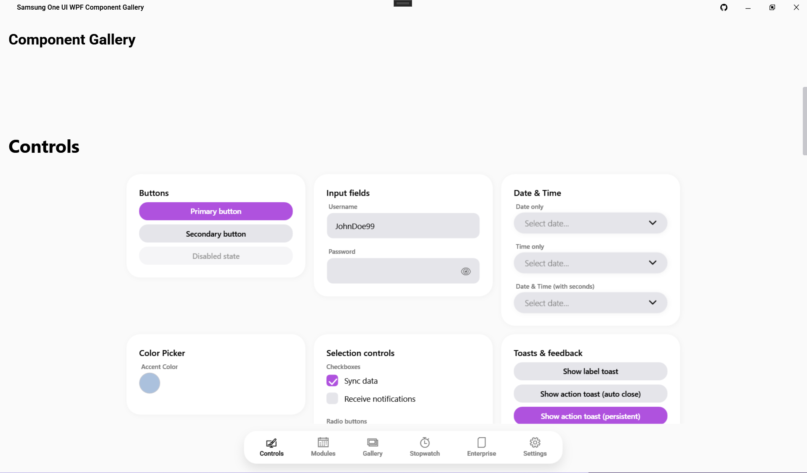
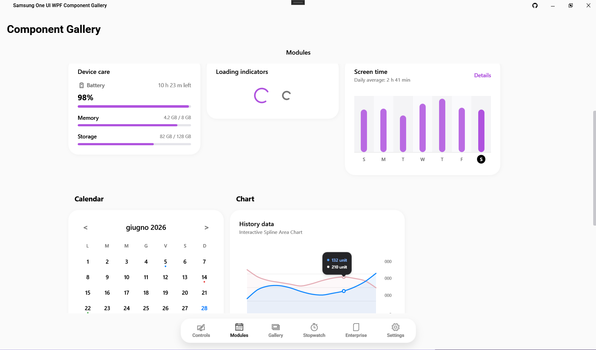
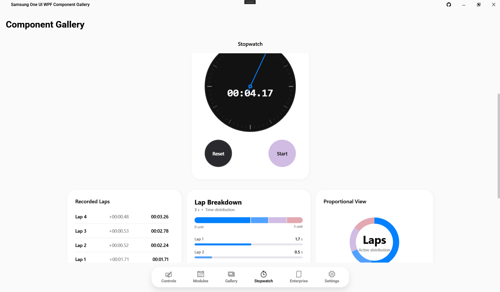
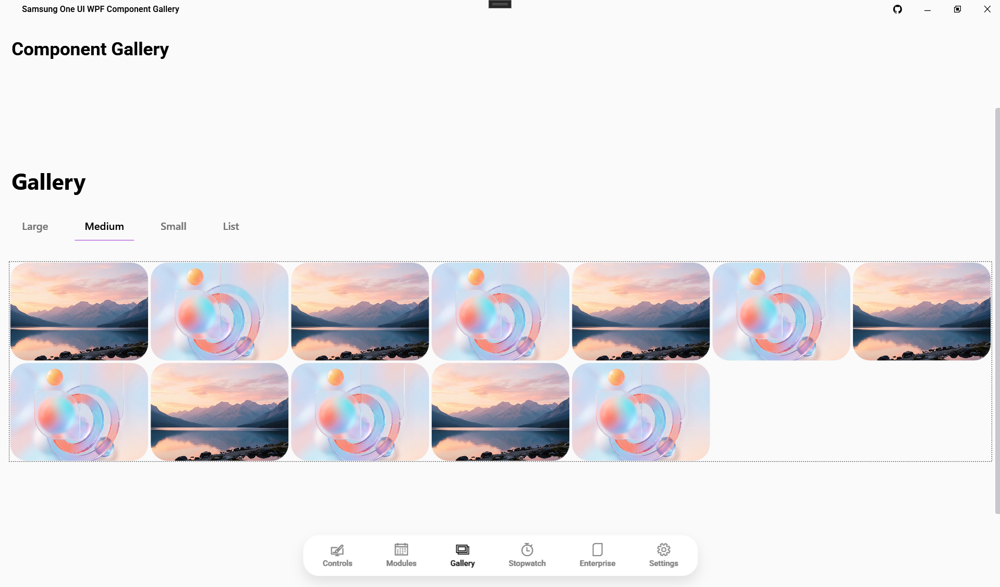
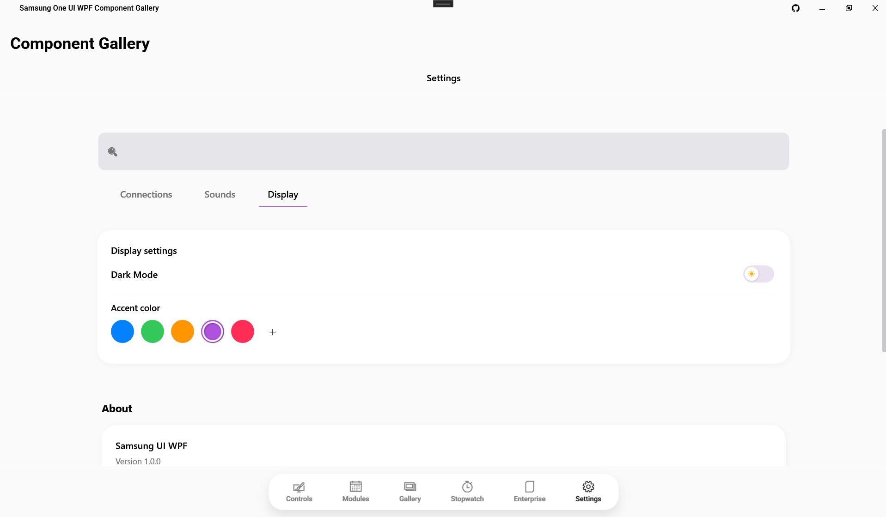
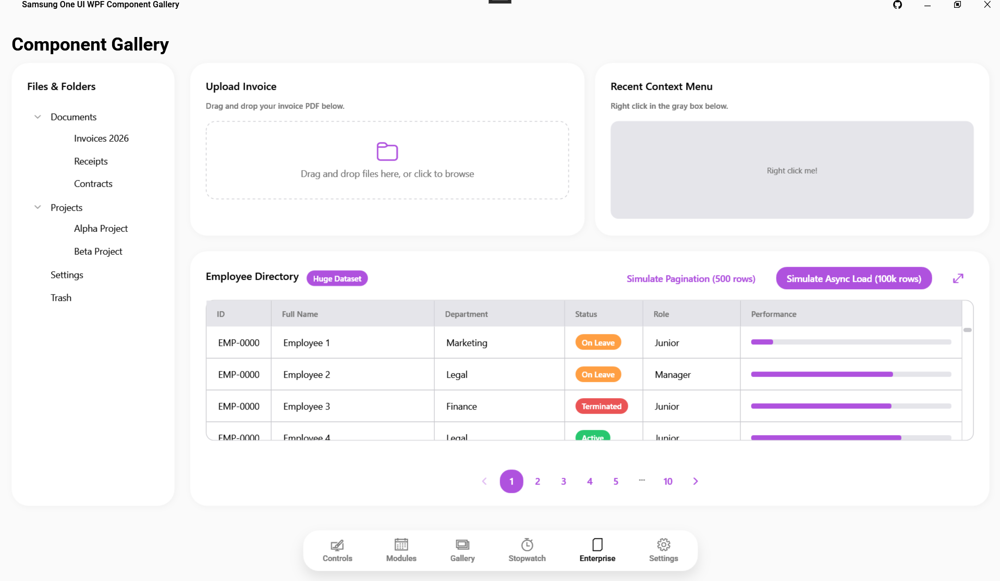

# Samsung One UI for WPF

> [!NOTE]
> 🇬🇧 A beautiful, modern, and fluid UI component library for WPF, inspired by Samsung One UI design guidelines.
> 🇮🇹 Una libreria di componenti UI bella, moderna e fluida per WPF, ispirata alle linee guida del design Samsung One UI.

> [!WARNING]
> **Disclaimer**: This is not an official Samsung library. It is a third-party open-source library created according to their public guidelines: [Samsung One UI Guidelines](https://developer.samsung.com/one-ui/structure/basic.html).<br>
> **Disclaimer**: Questa non è una libreria ufficiale di Samsung. È una libreria open-source di terze parti creata secondo le loro linee guida pubbliche: [Samsung One UI Guidelines](https://developer.samsung.com/one-ui/structure/basic.html).

[](https://dotnet.microsoft.com/)
[](https://opensource.org/licenses/MIT)
[](#)

---

### 📸 Screenshots

| Light Mode | Dark Mode |
|:---:|:---:|
|  |  |
|  |  |
|  |  |

**Other App Pages:**
- 
- 
- 
- 
- 
- 

---

## 🇬🇧 English

### 📖 About this project
> 📚 **[View the Component Documentation (Wiki)](docs/Home.md)**

Bring the clean, rounded aesthetics of Samsung devices directly to your Windows desktop applications. This library provides a comprehensive set of custom controls for WPF, designed to mimic the fluid animations, dynamic theming, and modern feel of Samsung's One UI.

### ✨ Key Features
- **Plug & Play**: Fully compliant with MVVM. Just drop the components in your XAML.
- **Fluid Animations**: Smooth transitions and micro-interactions typical of One UI.
- **Dynamic Theming**: Easily switch between Light and Dark mode using the built-in `ThemeManager`.
- **Rich Components**: Cards, Buttons, Calendar with dot-indicators, Animated Bar Charts, and more.

### ⚙️ Compatibility

| Framework | Supported |
|-----------|:---------:|
| .NET 8.0  | ✅ Yes    |
| .NET 7.0  | ✅ Yes    |
| .NET 6.0  | ✅ Yes    |
| .NET Framework 4.8 | ⚠️ Partial (Recommended .NET 6+) |

---

### 🚀 Getting Started

#### Step 1: Installation
*(Soon available on NuGet)*
For now, clone this repository and add a `ProjectReference` to the `SamsungUi` library in your Visual Studio solution.

#### Step 2: Setup Resources (`App.xaml`)
Open your `App.xaml` and include the unified control dictionary along with your preferred starting color scheme.

```xml
<Application.Resources>
    <ResourceDictionary>
        <ResourceDictionary.MergedDictionaries>
            <!-- 1. Load the color palette (Light or Dark) -->
            <ResourceDictionary Source="pack://application:,,,/SamsungUi;component/Themes/ColorsLight.xaml"/>
            <!-- 2. Load the generic control templates -->
            <ResourceDictionary Source="pack://application:,,,/SamsungUi;component/Themes/Generic.xaml"/>
        </ResourceDictionary.MergedDictionaries>
    </ResourceDictionary>
</Application.Resources>
```

#### Step 3: Your First Component
Add the `xmlns:sui` namespace to your Window and start using the components!

```xml
<Window x:Class="MyApp.MainWindow"
        xmlns="http://schemas.microsoft.com/winfx/2006/xaml/presentation"
        xmlns:x="http://schemas.microsoft.com/winfx/2006/xaml"
        xmlns:sui="clr-namespace:SamsungUi.Controls;assembly=SamsungUi"
        Title="My One UI App" Height="450" Width="800">
        
    <Grid Background="{DynamicResource OneUiBackgroundBrush}">
        <sui:SamsungButton Content="Click Me!" Variant="Primary" HorizontalAlignment="Center" VerticalAlignment="Center" />
    </Grid>
</Window>
```

#### Step 4: Changing Themes at Runtime
You can easily switch the application theme at runtime:
```csharp
using SamsungUi.Appearance;

// Switch to Dark Mode
ThemeManager.ApplyTheme(ThemeType.Dark);
```

---

### 🧩 Components Status

| Component Name | XAML Tag | Status |
|----------------|----------|:------:|
| Button | `<sui:SamsungButton>` | 🟢 Ready |
| EditBox | `<sui:SamsungEditBox>` | 🟢 Ready |
| PasswordBox | `<sui:SamsungPasswordBox>` | 🟢 Ready |
| CheckBox | `<sui:SamsungCheckBox>` | 🟢 Ready |
| DataGrid | `<sui:SamsungDataGrid>` | 🟢 Ready |
| DateTimePicker | `<sui:SamsungDateTimePicker>` | 🟢 Ready |
| ColorPicker | `<sui:SamsungColorPicker>` | 🟢 Ready |
| Chart (Bar/Donut) | `<sui:SamsungChart>` | 🟢 Ready |
| LineChart | `<sui:SamsungLineChart>` | 🟢 Ready |
| Modal | `<sui:SamsungModal>` | 🟢 Ready |
| Notification | `<sui:SamsungNotification>` | 🟢 Ready |
| Gallery | `<sui:Gallery>` (Concept) | 🟡 WIP |

> *For the full list of components, check the [Wiki](docs/Home.md).*

---

## 🇮🇹 Italiano

### 📖 Il progetto
> 📚 **[Visualizza la Documentazione dei Componenti (Wiki)](docs/Home.md)**

Porta l'estetica pulita e tondeggiante dei dispositivi Samsung direttamente sulle tue applicazioni desktop Windows. Questa libreria fornisce un set completo di controlli personalizzati per WPF, progettati per replicare le animazioni fluide, i temi dinamici e il feeling moderno della One UI di Samsung.

### ✨ Funzionalità Chiave
- **Plug & Play**: Piena compatibilità con MVVM. Trascina e usa i componenti nel tuo XAML.
- **Animazioni Fluide**: Transizioni morbide e micro-interazioni tipiche di One UI.
- **Temi Dinamici**: Passa facilmente dalla modalità Chiara a Scura usando il `ThemeManager` integrato.
- **Componenti Ricchi**: Card, Pulsanti, Calendario con indicatori, Grafici a barre animati e altro ancora.

### ⚙️ Compatibilità

| Framework | Supportato |
|-----------|:---------:|
| .NET 8.0  | ✅ Sì    |
| .NET 7.0  | ✅ Sì    |
| .NET 6.0  | ✅ Sì    |
| .NET Framework 4.8 | ⚠️ Parziale (Consigliato .NET 6+) |

---

### 🚀 Getting Started (Guida Rapida)

#### Step 1: Installazione
*(Presto disponibile su NuGet)*
Per ora, clona questa repository e aggiungi una `ProjectReference` alla libreria `SamsungUi` nella tua soluzione Visual Studio.

#### Step 2: Setup Risorse (`App.xaml`)
Apri il file `App.xaml` e includi il dizionario dei controlli unificato insieme alla combinazione di colori preferita.

```xml
<Application.Resources>
    <ResourceDictionary>
        <ResourceDictionary.MergedDictionaries>
            <!-- 1. Carica la palette colori (Chiara o Scura) -->
            <ResourceDictionary Source="pack://application:,,,/SamsungUi;component/Themes/ColorsLight.xaml"/>
            <!-- 2. Carica i template generici dei controlli -->
            <ResourceDictionary Source="pack://application:,,,/SamsungUi;component/Themes/Generic.xaml"/>
        </ResourceDictionary.MergedDictionaries>
    </ResourceDictionary>
</Application.Resources>
```

#### Step 3: Il tuo primo componente
Aggiungi il namespace `xmlns:sui` alla tua Window e inizia a usare i componenti!

```xml
<Window x:Class="MyApp.MainWindow"
        xmlns="http://schemas.microsoft.com/winfx/2006/xaml/presentation"
        xmlns:x="http://schemas.microsoft.com/winfx/2006/xaml"
        xmlns:sui="clr-namespace:SamsungUi.Controls;assembly=SamsungUi"
        Title="La mia App One UI" Height="450" Width="800">
        
    <Grid Background="{DynamicResource OneUiBackgroundBrush}">
        <sui:SamsungButton Content="Cliccami!" Variant="Primary" HorizontalAlignment="Center" VerticalAlignment="Center" />
    </Grid>
</Window>
```

#### Step 4: Cambiare tema a runtime
Puoi cambiare il tema dell'applicazione dinamicamente:
```csharp
using SamsungUi.Appearance;

// Passa alla modalità Scura
ThemeManager.ApplyTheme(ThemeType.Dark);
```

---
**Samsung One UI for WPF** - Created by Violet Miller.
