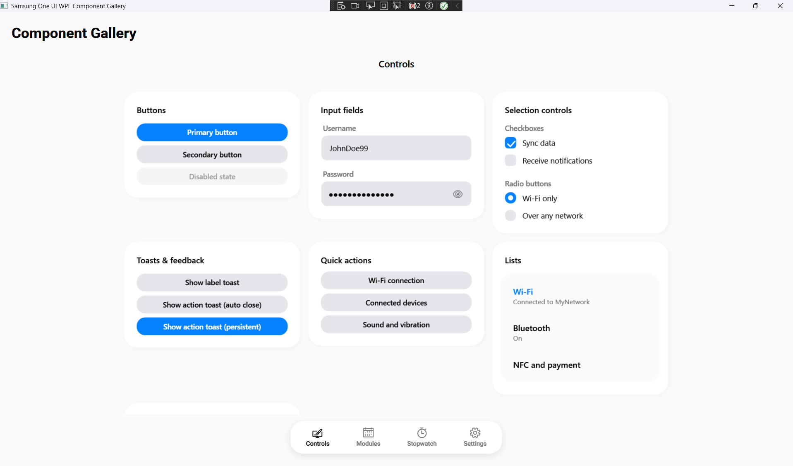
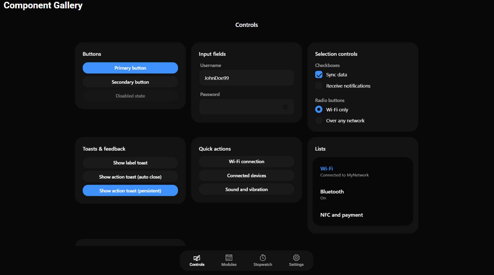
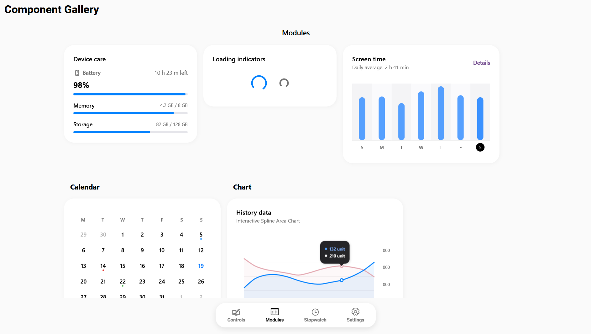
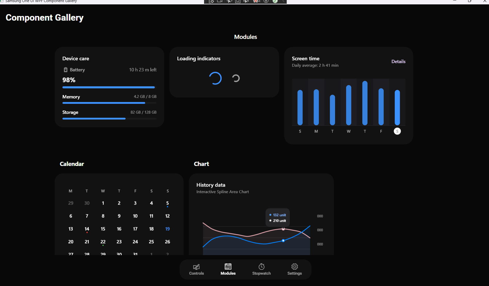
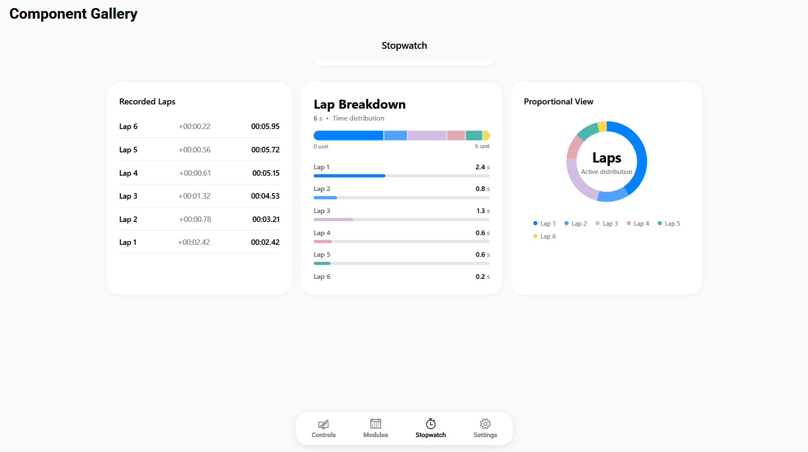
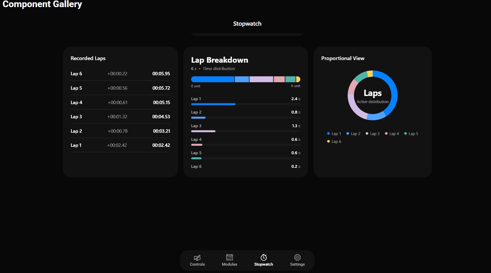

# Samsung One UI for WPF

> [!NOTE]
> 🇬🇧 A beautiful, modern, and fluid UI component library for WPF, inspired by Samsung One UI design guidelines.
> 🇮🇹 Una libreria di componenti UI bella, moderna e fluida per WPF, ispirata alle linee guida del design Samsung One UI.

[](https://dotnet.microsoft.com/)
[](https://opensource.org/licenses/MIT)
[](#)

---

## 🇬🇧 English

### 📖 About this project
> 📚 **[View the Component Documentation (Wiki)](docs/Home.md)**

I built this library purely out of passion and as a personal hobby. I've always loved the clean, rounded aesthetics of Samsung devices and wanted to bring that same experience to WPF desktop applications. 
Since this is a solo passion project (with the occasional help of an AI assistant to speed up the boring parts!), please consider it a **Work In Progress**. You might encounter some minor bugs or missing features.

For the official design system documentation, check out the [Samsung One UI Guidelines](https://developer.samsung.com/one-ui).

### ✨ Features
- **Fluid Animations**: Smooth transitions and micro-interactions typical of One UI.
- **Dynamic Theming**: Easily switch between Light and Dark mode using the built-in `ThemeManager`.
- **Rich Components**: Cards, Buttons, Calendar with dot-indicators, Animated Bar Charts, and more.
- **Modular Input Fields & Modals**: Highly customizable inputs and animated overlay modals for data insertion.

### 📦 Installation
*(Soon available on NuGet)*
For now, clone this repository and add a `ProjectReference` to the `SamsungUi` library in your solution.

### 🚀 Usage
Open your `App.xaml` and include the unified control dictionary along with your preferred starting color scheme:

```xml
<Application.Resources>
    <ResourceDictionary>
        <ResourceDictionary.MergedDictionaries>
            <ResourceDictionary Source="pack://application:,,,/SamsungUi;component/Themes/ColorsLight.xaml"/>
            <ResourceDictionary Source="pack://application:,,,/SamsungUi;component/Themes/SamsungUi.Controls.xaml"/>
        </ResourceDictionary.MergedDictionaries>
    </ResourceDictionary>
</Application.Resources>
```

You can easily switch the application theme at runtime:
```csharp
using SamsungUi.Appearance;
ThemeManager.ApplyTheme(ThemeType.Dark); // or ThemeType.Light
```

### 📸 Screenshots
- 
- 
- 
- 
- 
- 

### 🧩 Components Status

| Component Name | XAML Tag | Status |
|----------------|----------|:------:|
| Button | `<sui:SamsungButton>` | 🟢 |
| Card | `<sui:SamsungCard>` | 🟢 |
| CheckBox | `<sui:SamsungCheckBox>` | 🟢 |
| EditBox | `<sui:SamsungEditBox>` | 🟢 |
| PasswordBox | `<sui:SamsungPasswordBox>` | 🟢 |
| TextBox | `<sui:SamsungTextBox>` | 🟢 |
| ListBox | `<sui:SamsungListBox>` | 🟢 |
| Slider | `<sui:SamsungSlider>` | 🟢 |
| RadioButton | `<sui:SamsungRadioButton>` | 🟢 |
| ProgressBar | `<sui:SamsungProgressBar>` | 🟢 |
| Stopwatch | `<sui:SamsungStopwatch>` | 🟢 |
| TabControl | `<sui:SamsungTabControl>` | 🟢 |
| ToggleSwitch | `<sui:SamsungToggleSwitch>` | 🟢 |
| ExpandablePage | `<sui:SamsungExpandablePage>` | 🟢 |
| SegmentedBar | `<sui:SamsungSegmentedBar>` | 🟢 |
| Modal | `<sui:SamsungModal>` | 🟢 |
| NavigationBar | `<sui:SamsungNavigationBar>` | 🟢 |
| ToastService | `SamsungToastService.Show()` | 🟢 |
| DateTimePicker | `<sui:SamsungDateTimePicker>` | 🟢 |
| ColorPicker | `<sui:SamsungColorPicker>` | 🟢 |
| Chart (Bar/Donut) | `<sui:SamsungChart>` | 🟢 |
| ComboBox | `<sui:SamsungComboBox>` | 🟢 |
| Badge | `<sui:SamsungBadge>` | 🟢 |
| Stepper | `<sui:SamsungStepper>` | 🟢 |
| Expander | `<sui:SamsungExpander>` | 🟢 |
| Tooltip | `ToolTip="..."` | 🟢 |
| Window | `<sui:SamsungWindow>` | 🟢 |
| DataGrid | `<sui:SamsungDataGrid>` | 🟡 |
| Gallery | `<sui:Gallery>` (Concept) | 🟡 |

*(Legend: 🟢 Completed | 🟡 Work in Progress | 🔴 Draft/Defective)*

### 📝 Examples
Here are some quick examples of how to use the components in your XAML:

**SamsungButton**
```xml
<sui:SamsungButton Content="Click Me" IsPrimary="True" />
```

**SamsungEditBox**
```xml
<sui:SamsungEditBox Hint="Username" InputType="Text" />
<sui:SamsungEditBox Hint="Password" InputType="Password" />
```

**SamsungCard**
```xml
<sui:SamsungCard>
    <TextBlock Text="Hello World from One UI!" FontSize="16" />
</sui:SamsungCard>
```

---

## 🇮🇹 Italiano

### 📖 Il progetto
> 📚 **[Visualizza la Documentazione dei Componenti (Wiki)](docs/Home.md)**

Ho creato questa libreria per pura passione e come passatempo personale. Ho sempre adorato l'estetica pulita e tondeggiante dei dispositivi Samsung e volevo portare la stessa esperienza sulle applicazioni desktop WPF.
Trattandosi di un progetto amatoriale sviluppato nel tempo libero (aiutandomi di tanto in tanto con un assistente IA per velocizzare le parti più tediose!), ti prego di considerarlo un **Work In Progress**. Il codice potrebbe contenere ancora dei piccoli errori o comportamenti imprevisti.

Per la documentazione ufficiale del design system, puoi visitare le [Linee guida Samsung One UI](https://developer.samsung.com/one-ui).

### ✨ Funzionalità
- **Animazioni Fluide**: Transizioni morbide e micro-interazioni tipiche di One UI.
- **Temi Dinamici**: Passa facilmente dalla modalità Chiara a Scura usando il `ThemeManager` integrato.
- **Componenti Ricchi**: Card, Pulsanti, Calendario con indicatori, Grafici a barre animati e altro ancora.
- **Campi di Input e Modali Modulari**: Input altamente personalizzabili e modali sovrapposti animati per l'inserimento dati.

### 📦 Installazione
*(Presto disponibile su NuGet)*
Per ora, clona questa repository e aggiungi una `ProjectReference` alla libreria `SamsungUi` nella tua soluzione.

### 🚀 Utilizzo
Apri il file `App.xaml` e includi il dizionario dei controlli unificato insieme alla combinazione di colori preferita per la partenza:

```xml
<Application.Resources>
    <ResourceDictionary>
        <ResourceDictionary.MergedDictionaries>
            <ResourceDictionary Source="pack://application:,,,/SamsungUi;component/Themes/ColorsLight.xaml"/>
            <ResourceDictionary Source="pack://application:,,,/SamsungUi;component/Themes/SamsungUi.Controls.xaml"/>
        </ResourceDictionary.MergedDictionaries>
    </ResourceDictionary>
</Application.Resources>
```

Puoi cambiare il tema dell'applicazione a runtime:
```csharp
using SamsungUi.Appearance;
ThemeManager.ApplyTheme(ThemeType.Dark); // o ThemeType.Light
```

### 📸 Screenshot
- 
- 
- 
- 
- 
- 

### 🧩 Stato dei Componenti

| Nome Componente | Tag XAML | Stato |
|-----------------|----------|:-----:|
| Button | `<sui:SamsungButton>` | 🟢 |
| Card | `<sui:SamsungCard>` | 🟢 |
| CheckBox | `<sui:SamsungCheckBox>` | 🟢 |
| EditBox | `<sui:SamsungEditBox>` | 🟢 |
| PasswordBox | `<sui:SamsungPasswordBox>` | 🟢 |
| TextBox | `<sui:SamsungTextBox>` | 🟢 |
| ListBox | `<sui:SamsungListBox>` | 🟢 |
| Slider | `<sui:SamsungSlider>` | 🟢 |
| RadioButton | `<sui:SamsungRadioButton>` | 🟢 |
| ProgressBar | `<sui:SamsungProgressBar>` | 🟢 |
| Stopwatch | `<sui:SamsungStopwatch>` | 🟢 |
| TabControl | `<sui:SamsungTabControl>` | 🟢 |
| ToggleSwitch | `<sui:SamsungToggleSwitch>` | 🟢 |
| ExpandablePage | `<sui:SamsungExpandablePage>` | 🟢 |
| SegmentedBar | `<sui:SamsungSegmentedBar>` | 🟢 |
| Modal | `<sui:SamsungModal>` | 🟢 |
| NavigationBar | `<sui:SamsungNavigationBar>` | 🟢 |
| ToastService | `SamsungToastService.Show()` | 🟢 |
| DateTimePicker | `<sui:SamsungDateTimePicker>` | 🟢 |
| ColorPicker | `<sui:SamsungColorPicker>` | 🟢 |
| Chart (Bar/Donut) | `<sui:SamsungChart>` | 🟢 |
| ComboBox | `<sui:SamsungComboBox>` | 🟢 |
| Badge | `<sui:SamsungBadge>` | 🟢 |
| Stepper | `<sui:SamsungStepper>` | 🟢 |
| Expander | `<sui:SamsungExpander>` | 🟢 |
| Tooltip | `ToolTip="..."` | 🟢 |
| Window | `<sui:SamsungWindow>` | 🟢 |
| DataGrid | `<sui:SamsungDataGrid>` | 🟡 |
| Gallery | `<sui:Gallery>` (Concept) | 🟡 |

*(Legenda: 🟢 Completato | 🟡 Work in Progress | 🔴 Bozza/Difettoso)*

### 📝 Esempi di utilizzo
Ecco alcuni rapidi esempi di come utilizzare i componenti all'interno del tuo XAML:

**SamsungButton**
```xml
<sui:SamsungButton Content="Cliccami" IsPrimary="True" />
```

**SamsungEditBox**
```xml
<sui:SamsungEditBox Hint="Nome utente" InputType="Text" />
<sui:SamsungEditBox Hint="Password" InputType="Password" />
```

**SamsungCard**
```xml
<sui:SamsungCard>
    <TextBlock Text="Ciao Mondo da One UI!" FontSize="16" />
</sui:SamsungCard>
```

---
**Samsung One UI for WPF** - Created by Violet Miller.
