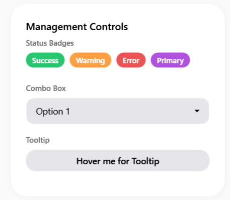
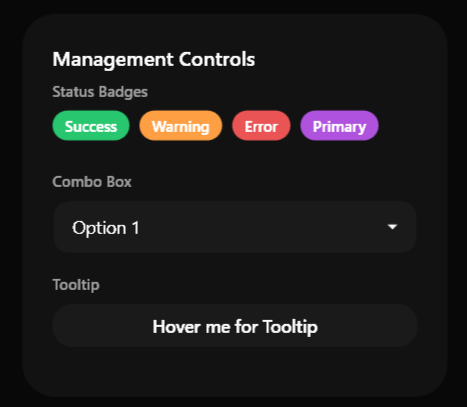

# SamsungBadge

### Screenshots
| Light | Dark |
|:---:|:---:|
|  |  |


Il `SamsungBadge` è un piccolo elemento visivo a forma di pillola che serve a evidenziare uno stato, un conteggio, o un'etichetta (es. "Nuovo", "In Attesa", "Completato").


> 📸 *Lo screenshot è in pausa caffè! Lo sviluppatore lo caricherà a breve.*

---

## 🇬🇧 English

The `SamsungBadge` is a small, pill-shaped visual element used to highlight a status, a count, or a label (e.g., "New", "Pending", "Completed").

### Inheritance
Inherits from `System.Windows.Controls.ContentControl`. It is very simple and just applies a specific background and padding to its content.

### Custom Properties

| Property | Type | Default Value | Description |
|-----------|------|-------------------|-------------|
| **BadgeStyle** | `BadgeStyle` | `Default` | Enum that determines the background color. |

**`BadgeStyle` Enum:**
- `Default`: Subtle gray/surface color.
- `Primary`: Bold primary accent color with white text.
- `Success`: Green color.
- `Warning`: Yellow/Orange color.
- `Danger`: Red color.

### How to Use
```xml
<sui:SamsungBadge Content="New" BadgeStyle="Primary" />
```

---

## 🇮🇹 Italiano

Il `SamsungBadge` è un piccolo elemento visivo a forma di pillola che serve a evidenziare uno stato, un conteggio, o un'etichetta (es. "Nuovo", "In Attesa", "Completato", "Errore").

### Ereditarietà
Eredita da `System.Windows.Controls.ContentControl`. È un controllo molto leggero che si limita ad applicare il padding corretto e lo sfondo appropriato al testo.

### Proprietà Personalizzate

| Proprietà | Tipo | Valore di Default | Descrizione |
|-----------|------|-------------------|-------------|
| **BadgeStyle** | `BadgeStyle` | `Default` | Enumerazione che determina il set di colori (Sfondo e Testo) del badge. |

**Enumerazione `BadgeStyle`:**
- `Default`: Colore grigio neutro o di superficie.
- `Primary`: Colore acceso del tema primario con testo bianco.
- `Success`: Tonalità verde per i successi.
- `Warning`: Tonalità gialla/arancione per gli avvisi.
- `Danger`: Tonalità rossa per gli errori.

### Come Usarlo
```xml
<sui:SamsungBadge Content="Completato" BadgeStyle="Success" />
```

