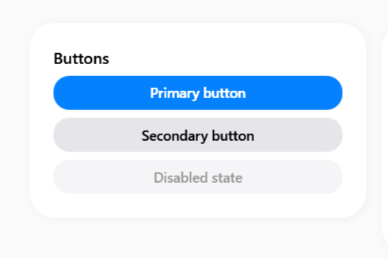
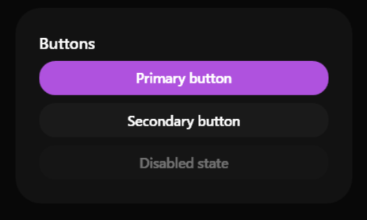

# SamsungButton

### Screenshots
| Light | Dark |
|:---:|:---:|
|  |  |


---

## 🇬🇧 English

The `SamsungButton` is the primary component for user actions. It is designed to mirror the classic One UI buttons, featuring heavily rounded corners, a "pill" style, and immediate visual feedback upon hover and click.

### Inheritance
This control directly inherits from the native WPF `System.Windows.Controls.Button` class.
It natively supports all classic events and bindings (`Click`, `Command`, `CommandParameter`, etc.).

### Custom Properties (Dependency Properties)

| Property | Type | Default Value | Description |
|-----------|------|-------------------|-------------|
| **Variant** | `ButtonVariant` | `Normal` | Defines the button style. Can be set to `Normal` (light/dark gray background based on theme) or `Primary` (uses the main accent color). |
| **CornerRadius** | `CornerRadius` | `20` | Corner smoothing. Default is 20 to achieve the typical "pill" effect. |
| **IsLoading** | `bool` | `False` | When set to true, disables the button and shows a spinning loading indicator. |
| **IconData** | `Geometry` | `null` | The SVG path data for the icon to display alongside the text. |
| **IconSize** | `double` | `18` | The size of the icon to display. |

**`ButtonVariant` Enum:**
- `Normal`: Neutral background, ideal for secondary buttons or standard actions (Cancel, Back, etc.).
- `Primary`: Colored background with white text, perfect for the main *Call To Action* (Save, Submit, Confirm).

### How to Use

Here are some practical examples to include in your XAML:

**1. Standard Button (Normal)**
```xml
<sui:SamsungButton Content="Secondary Button" 
                   Click="MyButton_Click" />
```

**2. Primary Button (Primary)**
```xml
<sui:SamsungButton Content="Main Action" 
                   Variant="Primary" 
                   Width="200" />
```

**3. Disabled Button**
```xml
<sui:SamsungButton Content="Not Clickable" 
                   IsEnabled="False" />
```

### Visual Behavior (States)
- **Hover (`IsMouseOver`)**: The background gently brightens or darkens depending on the theme.
- **Pressed (`IsPressed`)**: A slight scale-down and darkening effect is applied to give realistic tactile feedback.
- **Disabled (`IsEnabled=False`)**: Lowers the global opacity of the component to 50%.

---

## 🇮🇹 Italiano

Il `SamsungButton` è il componente principale per le azioni dell'utente. È stato progettato per ricalcare i classici pulsanti della One UI, caratterizzati da angoli fortemente arrotondati, uno stile "pillola" e un feedback visivo immediato al passaggio del mouse e al click.

### Ereditarietà
Questo controllo eredita direttamente dalla classe nativa WPF `System.Windows.Controls.Button`.
Supporta nativamente tutti gli eventi e i binding classici (`Click`, `Command`, `CommandParameter`, ecc.).

### Proprietà Personalizzate (Dependency Properties)

| Proprietà | Tipo | Valore di Default | Descrizione |
|-----------|------|-------------------|-------------|
| **Variant** | `ButtonVariant` | `Normal` | Definisce lo stile del pulsante. Può essere impostato su `Normal` (sfondo grigio chiaro/scuro in base al tema) oppure `Primary` (utilizza il colore di accento principale). |
| **CornerRadius** | `CornerRadius` | `20` | Smussatura degli angoli. Di default è impostato a 20 per ottenere il tipico effetto a "pillola". |
| **IsLoading** | `bool` | `False` | Quando è true, disabilita il pulsante e mostra un indicatore di caricamento rotante. |
| **IconData** | `Geometry` | `null` | Il dato del percorso SVG per l'icona da visualizzare accanto al testo. |
| **IconSize** | `double` | `18` | La dimensione dell'icona da visualizzare. |

**Enumerazione `ButtonVariant`:**
- `Normal`: Sfondo neutro, ideale per pulsanti secondari o azioni standard (Annulla, Indietro, ecc.).
- `Primary`: Sfondo colorato e testo bianco, perfetto per la *Call To Action* principale (Salva, Invia, Conferma).

### Come Usarlo

Ecco alcuni esempi pratici da inserire nel tuo file XAML:

**1. Pulsante Standard (Normal)**
```xml
<sui:SamsungButton Content="Pulsante Secondario" 
                   Click="MioBottone_Click" />
```

**2. Pulsante Primario (Primary)**
```xml
<sui:SamsungButton Content="Pulsante Principale" 
                   Variant="Primary" 
                   Width="200" />
```

**3. Pulsante Disabilitato**
```xml
<sui:SamsungButton Content="Non Cliccabile" 
                   IsEnabled="False" />
```

### Comportamento Visivo (Stati)
- **Hover (`IsMouseOver`)**: Il colore di sfondo cambia dolcemente schiarendosi o scurendosi in base al tema.
- **Pressed (`IsPressed`)**: Viene applicato un effetto di oscuramento/rimpicciolimento per restituire una sensazione tattile realistica.
- **Disabled (`IsEnabled=False`)**: Abbassa l'opacità globale del componente al 50%.

