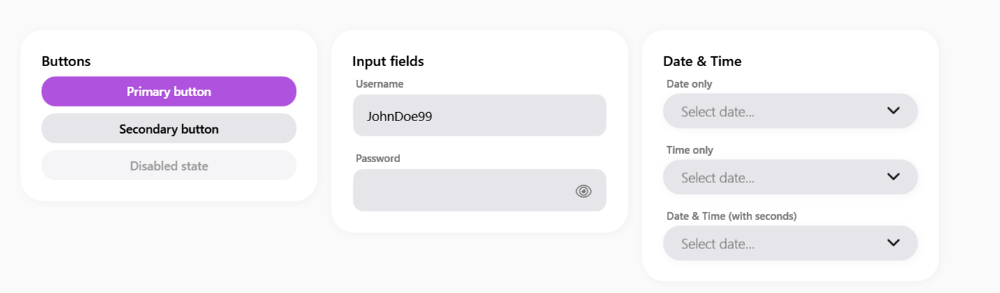

# SamsungCard

Il `SamsungCard` è il contenitore base per strutturare il layout in stile One UI. Raggruppa i contenuti in blocchi visivi coerenti, con ampi bordi arrotondati e uno sfondo neutro.


> 📸 *Lo screenshot è in pausa caffè! Lo sviluppatore lo caricherà a breve.*

---

## 🇬🇧 English

The `SamsungCard` is the foundational container for structuring layouts in the One UI style. It groups related content into cohesive visual blocks, featuring large rounded corners and a neutral background.

### Inheritance
Inherits from `System.Windows.Controls.ContentControl`. You can place any UI element inside it as `Content`.

### Custom Properties
| Property | Type | Default Value | Description |
|-----------|------|-------------------|-------------|
| **CornerRadius** | `CornerRadius` | `20` | Corner smoothing. Default is 20 for rounded edges. |

### Visual Behavior
- **Background**: Solid surface color, adapting automatically to Light/Dark modes.
- **Borders**: Highly rounded (`CornerRadius="20"` internally) with a subtle drop shadow to lift the card off the page background.
- **Padding**: Comes with comfortable default padding to ensure content breathes properly.

### How to Use
```xml
<sui:SamsungCard>
    <StackPanel>
        <TextBlock Text="Card Title" FontSize="18" FontWeight="Bold" />
        <TextBlock Text="This is the card content." />
    </StackPanel>
</sui:SamsungCard>
```

---

## 🇮🇹 Italiano

Il `SamsungCard` è il contenitore base per strutturare il layout in stile One UI. Raggruppa i contenuti in blocchi visivi coerenti, con ampi bordi arrotondati e uno sfondo neutro.

### Ereditarietà
Eredita da `System.Windows.Controls.ContentControl`. Puoi inserire qualsiasi elemento UI al suo interno tramite la proprietà `Content`.

### Proprietà Personalizzate
| Proprietà | Tipo | Valore di Default | Descrizione |
|-----------|------|-------------------|-------------|
| **CornerRadius** | `CornerRadius` | `20` | Smussatura degli angoli. Di default è impostato a 20 per bordi arrotondati. |

### Comportamento Visivo
- **Sfondo**: Colore solido di superficie (`SurfaceBrush`), che si adatta automaticamente al tema Chiaro/Scuro.
- **Bordi**: Fortemente arrotondati (`CornerRadius="20"`) con una leggerissima ombra esterna per staccare la Card dallo sfondo della pagina.
- **Padding**: Include dei margini interni predefiniti ampi per far "respirare" i contenuti in modo naturale.

### Come Usarlo
```xml
<sui:SamsungCard>
    <StackPanel>
        <TextBlock Text="Titolo Card" FontSize="18" FontWeight="Bold" />
        <TextBlock Text="Questo è il contenuto della card." />
    </StackPanel>
</sui:SamsungCard>
```
