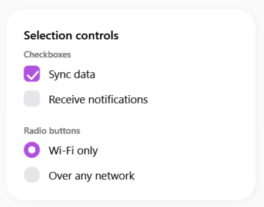
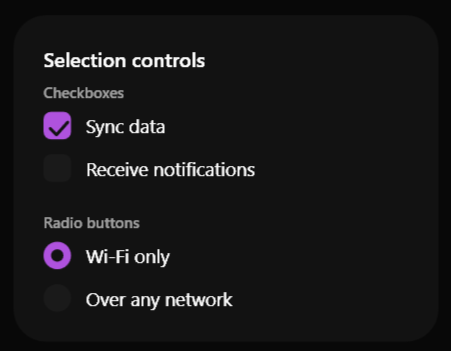

# SamsungCheckBox

### Screenshots
| Light Mode | Dark Mode |
|:---:|:---:|
|  |  |


Il `SamsungCheckBox` è un componente di selezione multipla che ripropone il design pulito e arrotondato della One UI. Perfetto per le liste di opzioni in cui l'utente può selezionare più elementi contemporaneamente.


> 📸 *Lo screenshot è in pausa caffè! Lo sviluppatore lo caricherà a breve.*

---

## 🇬🇧 English

The `SamsungCheckBox` is a multiple-selection component that brings the clean, rounded design of One UI. It's perfect for option lists where the user can select multiple items simultaneously.

### Inheritance
This control inherits directly from the native WPF `System.Windows.Controls.CheckBox` class. 
It supports all classic properties and bindings natively (`IsChecked`, `Checked`, `Unchecked`, `Command`, etc.).

### Custom Properties
Currently, this component does not introduce new `DependencyProperty`. All visual magic (rounded checkmarks, smooth animations) is managed internally by the default style and triggers.

### Visual Behavior
- **Unchecked**: A subtle rounded border with the surface color.
- **Checked**: Smoothly fills with the primary accent color and draws an animated checkmark.
- **Hover (`IsMouseOver`)**: The background shows a soft circular hover effect around the box.

### How to Use
```xml
<sui:SamsungCheckBox Content="Remember me" IsChecked="True" />
```

---

## 🇮🇹 Italiano

Il `SamsungCheckBox` è un componente di selezione multipla che ripropone il design pulito e arrotondato della One UI. Perfetto per le liste di opzioni in cui l'utente può selezionare più elementi contemporaneamente.

### Ereditarietà
Questo controllo eredita direttamente dalla classe nativa WPF `System.Windows.Controls.CheckBox`.
Supporta nativamente tutte le proprietà e i binding classici (`IsChecked`, `Checked`, `Unchecked`, `Command`, ecc.).

### Proprietà Personalizzate
Al momento, questo componente non introduce nuove `DependencyProperty`. Tutta la magia visiva (spunte arrotondate, animazioni fluide) è gestita internamente dallo stile di default.

### Comportamento Visivo
- **Unchecked**: Un bordo arrotondato e delicato con il colore di superficie.
- **Checked**: Si riempie dolcemente con il colore primario (Primary Accent) e disegna una spunta animata.
- **Hover (`IsMouseOver`)**: Mostra un delicato alone circolare di sfondo attorno al riquadro per indicare l'interattività.

### Come Usarlo
```xml
<sui:SamsungCheckBox Content="Ricordami" IsChecked="True" />
```

