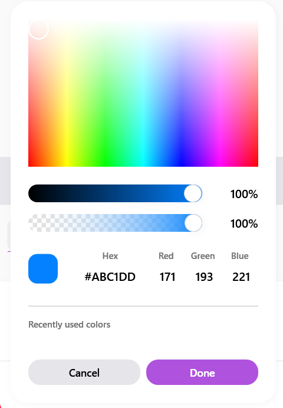

# SamsungColorPicker

Il `SamsungColorPicker` è un pannello avanzato per la selezione del colore. Permette di selezionare tonalità visivamente, inserirle manualmente o recuperare i colori usati di recente.


> 📸 *Lo screenshot è in pausa caffè! Lo sviluppatore lo caricherà a breve.*

---

## 🇬🇧 English

The `SamsungColorPicker` is an advanced panel for color selection. It allows users to visually pick a hue, manually enter values, and quickly select from recently used colors.

### Inheritance
Inherits from `System.Windows.Controls.Control` and implements a fully custom UI integrating sliders, visual gradients, and a popup overlay.

### Custom Properties

| Property | Type | Default Value | Description |
|-----------|------|-------------------|-------------|
| **SelectedColor** | `Color` | `White` | The globally selected color. |
| **Hue** | `double` | `0.0` | The hue angle (0-360) selected in the color spectrum slider. |
| **Saturation** | `double` | `1.0` | The saturation (0-1). |
| **Value** | `double` | `1.0` | The brightness/value (0-1). |
| **Alpha** | `double` | `1.0` | The opacity value (0-1). |
| **RecentColors** | `Collection` | `null` | Holds the list of recently chosen colors to show in the swatches panel. |

### Visual Behavior
- **Gradient Canvas**: A rich 2D canvas that interpolates Saturation and Value based on the chosen Hue.
- **Hue Slider**: A horizontal slider rendered with an active rainbow gradient.
- **Alpha Slider**: A transparency slider featuring a checkered background pattern.

### How to Use
```xml
<sui:SamsungColorPicker SelectedColor="{Binding AccentColor, Mode=TwoWay}" />
```

---

## 🇮🇹 Italiano

Il `SamsungColorPicker` è un pannello avanzato per la selezione del colore. Permette di selezionare tonalità visivamente, inserirle manualmente in vari formati o recuperare i colori usati di recente.

### Ereditarietà
Eredita da `System.Windows.Controls.Control` e implementa un'interfaccia XAML su misura, raggruppando slider personalizzati, canvas con gradienti e un overlay a scomparsa (Popup).

### Proprietà Personalizzate

| Proprietà | Tipo | Valore di Default | Descrizione |
|-----------|------|-------------------|-------------|
| **SelectedColor** | `Color` | `White` | Il colore finale selezionato. |
| **Hue** | `double` | `0.0` | L'angolo di tonalità (0-360) sull'asse orizzontale. |
| **Saturation** | `double` | `1.0` | La saturazione del colore (0-1). |
| **Value** | `double` | `1.0` | La luminosità del colore (0-1). |
| **Alpha** | `double` | `1.0` | L'opacità/canale Alpha (0-1). |
| **RecentColors** | `Collection` | `null` | Collezione di oggetti Color che appare nel pannello dei colori recenti (Swatches). |

### Comportamento Visivo
- **Canvas Gradiente**: Un riquadro 2D che sfuma orizzontalmente e verticalmente (Saturazione/Valore) in base alla tinta (Hue) scelta.
- **Slider della Tinta**: Uno slider orizzontale il cui background è disegnato con un gradiente arcobaleno continuo.
- **Slider Opacità**: Mostra il classico sfondo a scacchiera per far percepire visivamente il livello di trasparenza.

### Come Usarlo
```xml
<sui:SamsungColorPicker SelectedColor="{Binding MioColore, Mode=TwoWay}" />
```
