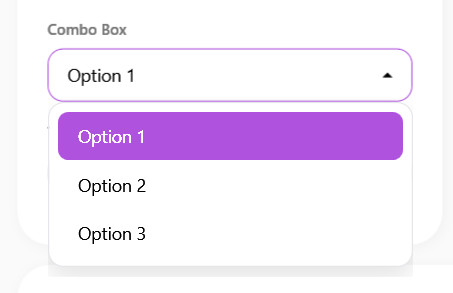

# SamsungComboBox

Il `SamsungComboBox` è una rilettura in chiave moderna del classico menu a tendina. Presenta uno stile a comparsa arrotondato e animato per mostrare la lista delle opzioni senza risultare visivamente pesante.


> 📸 *Lo screenshot è in pausa caffè! Lo sviluppatore lo caricherà a breve.*

---

## 🇬🇧 English

The `SamsungComboBox` is a modern take on the classic dropdown menu. It features a rounded and animated popup style to display the list of options cleanly without visual clutter.

### Inheritance
This control inherits directly from `System.Windows.Controls.ComboBox`.
You can bind items to it using `ItemsSource`, `DisplayMemberPath`, and handle selection via `SelectedItem` or `SelectedIndex`.

### Custom Properties
| Property | Type | Default Value | Description |
|-----------|------|-------------------|-------------|
| **Placeholder** | `string` | `""` | The placeholder text to display when no item is selected. |
| **CornerRadius** | `CornerRadius` | `16` | Corner smoothing. |

The custom appearance of both the toggle button (the visible field) and the floating popup are defined entirely via XAML control templates.

### Visual Behavior
- **Toggle Button (Field)**: The main field is styled similar to `SamsungTextBox`, with a solid neutral background, rounded corners, and a clean chevron arrow on the right.
- **Popup/Dropdown**: Instead of a hard-edged square box, the dropdown menu appears as a floating, heavily rounded "card" with a subtle shadow to detach it from the background layer.
- **Item Hover**: Hovering over the dropdown items highlights them with a pill-shaped background, maintaining the global One UI roundness.

### How to Use

```xml
<sui:SamsungComboBox SelectedIndex="0" Width="200">
    <ComboBoxItem Content="Option 1" />
    <ComboBoxItem Content="Option 2" />
    <ComboBoxItem Content="Option 3" />
</sui:SamsungComboBox>
```

---

## 🇮🇹 Italiano

Il `SamsungComboBox` è una rilettura in chiave moderna del classico menu a tendina. Presenta uno stile a comparsa arrotondato e animato per mostrare la lista delle opzioni senza risultare visivamente pesante.

### Ereditarietà
Questo controllo eredita direttamente da `System.Windows.Controls.ComboBox`.
Puoi associare le liste usando `ItemsSource`, `DisplayMemberPath`, e gestire la selezione con `SelectedItem` o `SelectedIndex`.

### Proprietà Personalizzate
| Proprietà | Tipo | Valore di Default | Descrizione |
|-----------|------|-------------------|-------------|
| **Placeholder** | `string` | `""` | Il testo di suggerimento mostrato quando nessun elemento è selezionato. |
| **CornerRadius** | `CornerRadius` | `16` | Smussatura degli angoli. |

L'aspetto personalizzato sia del pulsante di apertura (il campo visibile) che del menu a tendina fluttuante sono definiti interamente tramite i template XAML.

### Comportamento Visivo
- **Campo Base (Toggle Button)**: Il campo principale ricorda lo stile del `SamsungTextBox`, con uno sfondo neutro solido, angoli smussati e una freccetta stilizzata (chevron) sulla destra.
- **Menu a Tendina (Popup)**: Invece del classico riquadro spigoloso e tagliente, il menu compare come una "card" fluttuante, pesantemente arrotondata e dotata di una delicata ombreggiatura per staccarla dal livello sottostante.
- **Selezione Elementi (Item Hover)**: Passando col mouse sopra le opzioni, queste vengono evidenziate con uno sfondo a "pillola", per restare in linea con la rotondità generale della One UI.

### Come Usarlo

```xml
<sui:SamsungComboBox SelectedIndex="0" Width="200">
    <ComboBoxItem Content="Opzione 1" />
    <ComboBoxItem Content="Opzione 2" />
    <ComboBoxItem Content="Opzione 3" />
</sui:SamsungComboBox>
```
