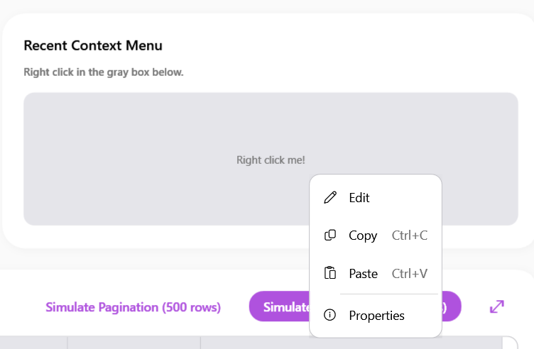
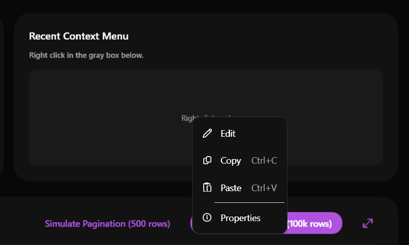

# SamsungContextMenu & SamsungMenuItem

### Screenshots
| Light Mode | Dark Mode |
|:---:|:---:|
|  |  |


`SamsungContextMenu` and `SamsungMenuItem` provide a custom-styled right-click context menu that adheres to the Samsung One UI design language. They replace the standard, rigid WPF menus with a soft, rounded, and elegantly animated alternative.

## Features

- **One UI Theming**: Features rounded corners, soft shadow overlays (`OneUiModalShadow`), and subtle highlight animations when hovering over menu items.
- **Icon Support**: `SamsungMenuItem` natively supports placing icons on the left side of the text.
- **Input Gesture Support**: Displays keyboard shortcuts (e.g., `Ctrl+C`, `Ctrl+V`) on the right side using a muted secondary text color.
- **Drop-in Replacement**: You can use them exactly where you would use standard WPF `ContextMenu` and `MenuItem` controls.

## Properties

### SamsungContextMenu

| Property | Type | Default Value | Description |
|---|---|---|---|
| `CornerRadius` | `CornerRadius` | `12` | The corner radius of the overall menu panel. |

### SamsungMenuItem

| Property | Type | Default Value | Description |
|---|---|---|---|
| `CornerRadius` | `CornerRadius` | `8` | The corner radius of the individual highlighted menu item row. |
| `Icon` | `object` | `null` | The icon to display. Usually set to a Unicode glyph string (e.g., `&#xE70F;` or `&#xE8AC;`), which is rendered automatically using Segoe Fluent Icons or Segoe MDL2 Assets font. |

*(Note: Standard properties like `Header`, `InputGestureText`, and `Command` are fully supported as they inherit from the base WPF controls).*

## Example Usage

You can attach a `SamsungContextMenu` to any `FrameworkElement` (like a Border, Button, or Card) using its `ContextMenu` property.

### XAML

```xml
<Border Background="{DynamicResource OneUiControlBackgroundBrush}" Padding="20" CornerRadius="12">
    <Border.ContextMenu>
        <sui:SamsungContextMenu>
            <sui:SamsungMenuItem Header="Upload File" Icon="&#xE8E5;" Click="UploadFile_Click"/>
            <sui:SamsungMenuItem Header="Upload Folder" Icon="&#xE838;"/>
            
            <Separator/>
            
            <sui:SamsungMenuItem Header="Copy" Icon="&#xE8C8;" InputGestureText="Ctrl+C"/>
            <sui:SamsungMenuItem Header="Paste" Icon="&#xE77F;" InputGestureText="Ctrl+V"/>
        </sui:SamsungContextMenu>
    </Border.ContextMenu>
    
    <TextBlock Text="Right click me!" />
</Border>
```

## Best Practices

- Use `&#x...` hex codes for the `Icon` property using the `Segoe Fluent Icons` or `Segoe MDL2 Assets` font family to maintain a consistent style.
- Use `<Separator/>` to group related actions inside the menu. The theme automatically styles the separator line to blend seamlessly with the dark/light mode.


