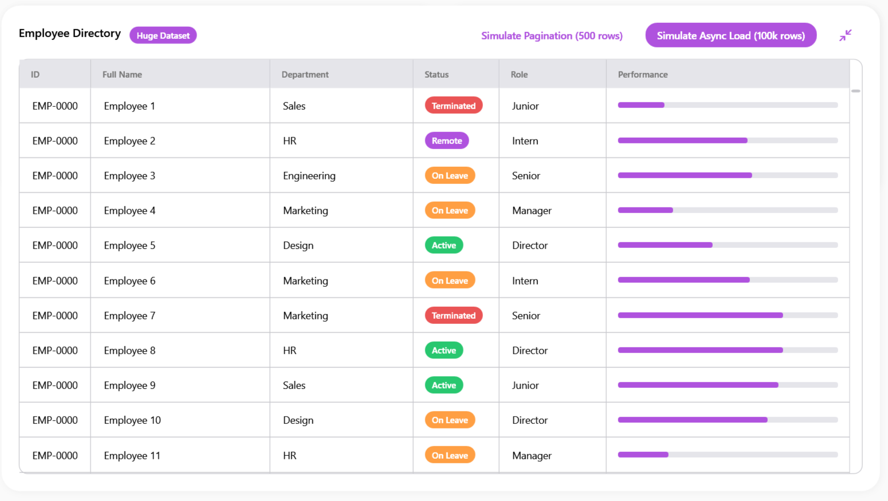
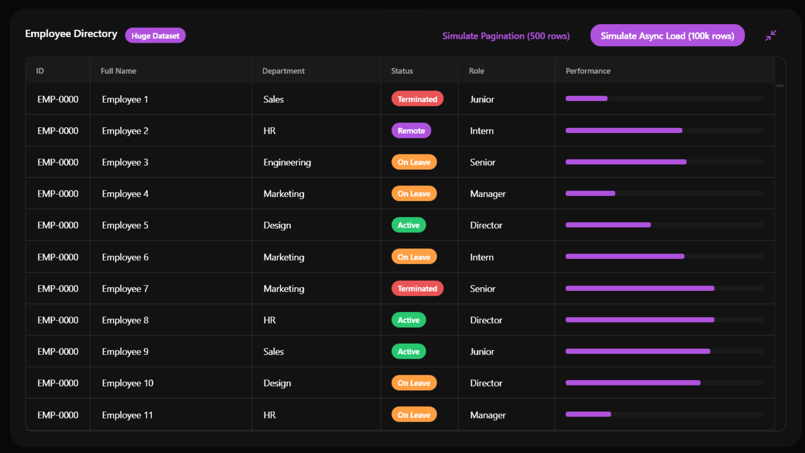
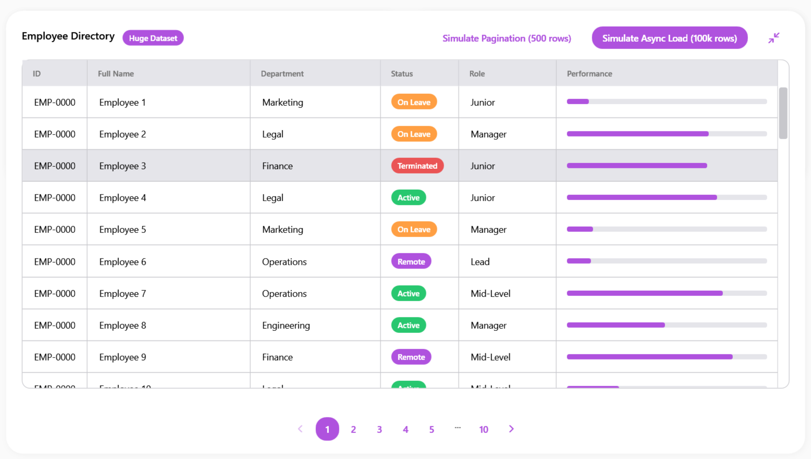
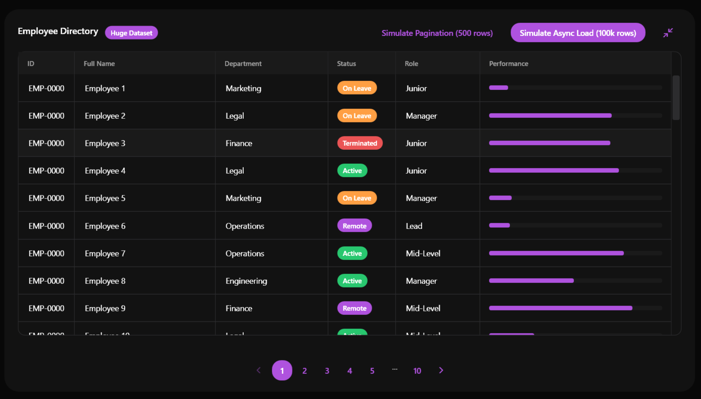

# SamsungDataGrid

### Screenshots
| Light Mode | Dark Mode |
|:---:|:---:|
|  |  |
|  |  |


`SamsungDataGrid` is the ultimate data presentation component for management, CRM, and ERP applications. It wraps the extraordinarily powerful WPF `DataGrid` in the fluid, clean, and rounded aesthetics of Samsung One UI.

## Features

- **Extreme Performance**: UI Virtualization and Row Recycling are enabled by default. You can load 100,000+ rows into the `ItemsSource` and experience zero scroll lag.
- **Built-in Async Loading State**: A custom `IsLoading` dependency property allows you to instantly blur the grid and display a centered `SamsungBusyIndicator`. Perfect for when you are fetching large datasets from a database or an API.
- **Sorting Integration**: Clicking on a column header will automatically display the ascending/descending chevron arrow. Furthermore, sorting heavy columns automatically triggers the `IsLoading` visual state to prevent UI freeze frustration.
- **Native WPF Power**: Because it inherits directly from `System.Windows.Controls.DataGrid`, you have full access to native features like Grouping, Filtering, Cell Editing, and `DataGridTemplateColumn`.

## Properties

| Property | Type | Default Value | Description |
|---|---|---|---|
| `CornerRadius` | `CornerRadius` | `16` | The corner radius of the outer border of the DataGrid. |
| `IsLoading` | `bool` | `false` | When set to true, displays a semi-transparent overlay with a loading ring to block user interaction during data fetching. |

*(Note: Inherits all 100+ native properties from standard WPF `DataGrid` such as `ItemsSource`, `SelectedItem`, `AutoGenerateColumns`, etc.)*.

## Example Usage

### XAML

```xml
<sui:SamsungDataGrid x:Name="MyGrid" 
                     CornerRadius="12"
                     MaxHeight="500">
    <sui:SamsungDataGrid.Columns>
        
        <!-- Standard Text Column -->
        <DataGridTextColumn Header="Full Name" Binding="{Binding Name}" Width="200"/>
        <DataGridTextColumn Header="Department" Binding="{Binding Department}" Width="150"/>
        
        <!-- Custom Template Column (Using SamsungBadge) -->
        <DataGridTemplateColumn Header="Status" Width="120">
            <DataGridTemplateColumn.CellTemplate>
                <DataTemplate>
                    <sui:SamsungBadge Content="{Binding Status}" HorizontalAlignment="Left">
                        <sui:SamsungBadge.Style>
                            <Style TargetType="sui:SamsungBadge" BasedOn="{StaticResource {x:Type sui:SamsungBadge}}">
                                <Style.Triggers>
                                    <DataTrigger Binding="{Binding Status}" Value="Active">
                                        <Setter Property="BadgeStyle" Value="Success"/>
                                    </DataTrigger>
                                    <DataTrigger Binding="{Binding Status}" Value="Terminated">
                                        <Setter Property="BadgeStyle" Value="Error"/>
                                    </DataTrigger>
                                </Style.Triggers>
                            </Style>
                        </sui:SamsungBadge.Style>
                    </sui:SamsungBadge>
                </DataTemplate>
            </DataGridTemplateColumn.CellTemplate>
        </DataGridTemplateColumn>

    </sui:SamsungDataGrid.Columns>
</sui:SamsungDataGrid>
```

### C# Code-Behind (Async Loading Example)

```csharp
private async void LoadData()
{
    // 1. Show the loading overlay
    MyGrid.IsLoading = true;

    // 2. Fetch data asynchronously (e.g. from SQL or Kaggle CSV)
    var employees = await FetchDataFromDatabaseAsync();

    // 3. Bind the data
    MyGrid.ItemsSource = employees;

    // 4. Hide the loading overlay
    MyGrid.IsLoading = false;
}
```

## Best Practices

- Always keep `AutoGenerateColumns="False"` (which is our default) and manually declare your columns. Automatically generated columns in WPF can cause unexpected formatting issues.
- Use `DataGridTemplateColumn` to insert other library components (like `SamsungProgressBar` or `SamsungButton`) inside the grid cells.
- If you place the `SamsungDataGrid` inside a `SamsungCard`, ensure the Card has `Padding="0"` so the grid can flush nicely against the rounded corners of the card.


