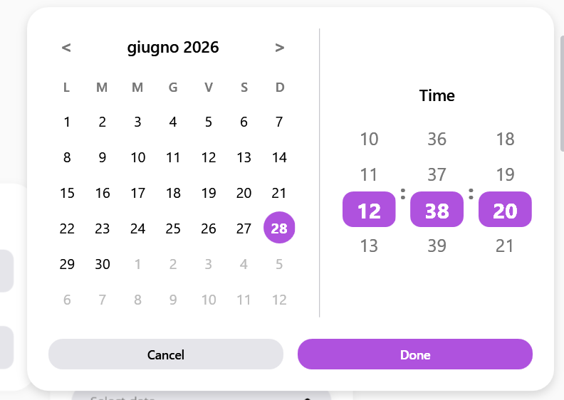
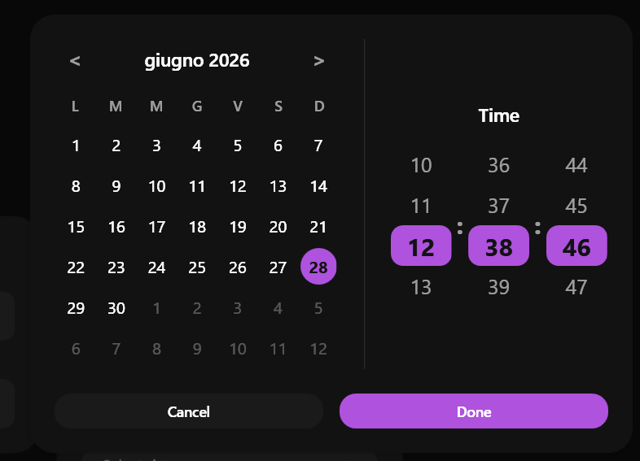

# SamsungDateTimePicker

### Screenshots
| Light Mode | Dark Mode |
|:---:|:---:|
|  |  |


Il `SamsungDateTimePicker` è un componente estremamente ricco per la selezione di date e orari. Sostituisce il vetusto `DatePicker` di WPF, introducendo un menu a tendina enorme, animato, e navigabile sia con scorrimento che con bottoni.


> 📸 *Lo screenshot è in pausa caffè! Lo sviluppatore lo caricherà a breve.*

---

## 🇬🇧 English

The `SamsungDateTimePicker` is an extremely rich component for selecting dates and times. It completely replaces the outdated WPF `DatePicker`, introducing an oversized, animated popup dropdown that can be navigated by scrolling or clicking.

### Inheritance
This control inherits from `System.Windows.Controls.Control` and builds a completely custom UI for both the input field and the complex popup.

### Custom Properties

| Property | Type | Default Value | Description |
|-----------|------|-------------------|-------------|
| **SelectedDate** | `DateTime?` | `null` | The currently selected date/time. Use this for data binding. |
| **PickerMode** | `Mode` | `DateTime` | Determines what the user can select: `Date`, `Time`, or `DateTime`. |
| **ShowSeconds** | `bool` | `False` | When true in Time/DateTime modes, adds a tumbler for seconds. |
| **Placeholder** | `string` | `"Select date..."`| Text shown when `SelectedDate` is null. |
| **CornerRadius** | `CornerRadius` | `20` | Corner smoothing. |
| **ConfirmText** | `string` | `"Done"` | Text for the confirmation button (useful for localization). |
| **CancelText** | `string` | `"Cancel"` | Text for the cancellation button. |
| **CurrentDisplayMonth** | `DateTime` | `Today` | The month currently displayed in the calendar view. |
| **ViewMode** | `CalendarViewMode`| `Month` | Defines if the calendar is showing Days, Months, or Years. |

### Visual Behavior
- **Popup Animation**: When opened, the massive popup card slides down softly with a fade-in effect.
- **Calendar Grid**: Fully redesigned with perfectly circular selection halos and modern typography.
- **Time Wheels**: Uses scrolling list boxes (spinners) that mimic mobile time pickers.

### How to Use
```xml
<sui:SamsungDateTimePicker PickerMode="DateTime" 
                           SelectedDate="{Binding MyDate}" />
```

---

## 🇮🇹 Italiano

Il `SamsungDateTimePicker` è un componente estremamente ricco per la selezione di date e orari. Sostituisce il vetusto `DatePicker` di WPF, introducendo un menu a tendina (Popup) enorme, animato e navigabile, ispirato all'app Calendario di Samsung.

### Ereditarietà
Questo controllo eredita da `System.Windows.Controls.Control` e costruisce un'interfaccia completamente su misura sia per il campo di testo (toggle) sia per il complesso popup del calendario/orologio.

### Proprietà Personalizzate

| Proprietà | Tipo | Valore di Default | Descrizione |
|-----------|------|-------------------|-------------|
| **SelectedDate** | `DateTime?` | `null` | La data/ora attualmente selezionata. Usa questa proprietà per il data binding. |
| **PickerMode** | `Mode` | `DateTime` | Determina cosa l'utente può selezionare: `Date`, `Time`, oppure `DateTime`. |
| **ShowSeconds** | `bool` | `False` | Se true nelle modalità Time/DateTime, aggiunge un selettore per i secondi. |
| **Placeholder** | `string` | `"Select date..."`| Testo mostrato quando `SelectedDate` è null. |
| **CornerRadius** | `CornerRadius` | `20` | Smussatura degli angoli. |
| **ConfirmText** | `string` | `"Done"` | Testo per il pulsante di conferma (utile per la localizzazione). |
| **CancelText** | `string` | `"Cancel"` | Testo per il pulsante di annullamento. |
| **CurrentDisplayMonth** | `DateTime` | `Today` | Il mese attualmente mostrato nella griglia del calendario. |
| **ViewMode** | `CalendarViewMode`| `Month` | Determina se il calendario sta mostrando i Giorni (Month), i Mesi (Year) o gli Anni (Decade). |

### Comportamento Visivo
- **Animazione Popup**: All'apertura, il grande pannello scivola fluidamente verso il basso in dissolvenza.
- **Griglia Calendario**: Completamente ridisegnata, usa aloni di selezione perfettamente circolari (stile pillola) e font moderni.
- **Ruote Orarie**: Utilizza delle liste a scorrimento infinito (spinners) per emulare il feeling dei selettori orari degli smartphone.

### Come Usarlo
```xml
<sui:SamsungDateTimePicker PickerMode="DateTime" 
                           SelectedDate="{Binding MyDate}" />
```


