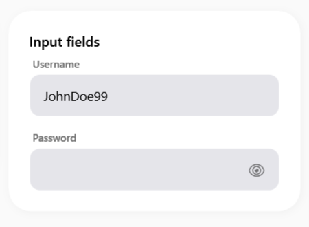

# SamsungEditBox

Il `SamsungEditBox` è un campo di testo avanzato ispirato allo stile "Material" adottato spesso anche in ambito mobile, caratterizzato da un'etichetta fluttuante (Floating Hint) e una linea di base animata. Supporta inoltre diverse tipologie di input.


> 📸 *Lo screenshot è in pausa caffè! Lo sviluppatore lo caricherà a breve.*

---

## 🇬🇧 English

The `SamsungEditBox` is an advanced text input field inspired by the "Material" style often adopted in mobile interfaces. It features a floating hint label and an animated bottom baseline, supporting various input types.

### Inheritance
This is a custom `Control` that internally encapsulates a `TextBox` and a `PasswordBox`, allowing it to handle different input scenarios seamlessly.

### Custom Properties

| Property | Type | Default Value | Description |
|-----------|------|-------------------|-------------|
| **Text** | `string` | `""` | The text content of the box. Binds two-way by default. |
| **Hint** | `string` | `""` | The placeholder text. When the user types, it scales down and floats above the text. |
| **InputType** | `InputType` | `Text` | Can be `Text`, `Password`, `Number`, or `Email`. Changes behavior (e.g., masks text if Password, filters non-digits if Number). |
| **IsPasswordRevealed** | `bool` | `False` | If `InputType` is `Password`, setting this to true will unmask the characters. |
| **HasText** | `bool` | `False` | (Read-only) Internal property used by the template to trigger the floating hint animation. |

### Visual Behavior
- **Floating Hint**: The `Hint` text sits in the middle. When focused or when `Text` is not empty, it smoothly shrinks and glides to the top border.
- **Animated Border**: The bottom border uses a `DoubleAnimation` to expand from the center outwards with the primary accent color when focused.

### How to Use
```xml
<sui:SamsungEditBox Hint="Username" InputType="Text" />
<sui:SamsungEditBox Hint="PIN Code" InputType="Number" />
```

---

## 🇮🇹 Italiano

Il `SamsungEditBox` è un campo di testo avanzato ispirato allo stile "Material" adottato spesso anche in ambito mobile. È caratterizzato da un'etichetta fluttuante (Floating Hint) e da una linea di base animata, e supporta nativamente diverse tipologie di input.

### Ereditarietà
Si tratta di un `Control` personalizzato che incapsula al suo interno sia una `TextBox` che una `PasswordBox`, gestendo dinamicamente l'interfaccia corretta in base al tipo di input richiesto.

### Proprietà Personalizzate

| Proprietà | Tipo | Valore di Default | Descrizione |
|-----------|------|-------------------|-------------|
| **Text** | `string` | `""` | Il contenuto del testo. Ha il binding bidirezionale attivo di default. |
| **Hint** | `string` | `""` | Il testo di suggerimento. Quando l'utente scrive o focalizza il campo, questo testo si rimpicciolisce e si posiziona in alto (Floating). |
| **InputType** | `InputType` | `Text` | Può essere `Text`, `Password`, `Number`, o `Email`. Cambia il comportamento del campo (es. maschera il testo se Password, filtra le lettere se Number). |
| **IsPasswordRevealed** | `bool` | `False` | Se `InputType` è `Password`, impostando questo valore a `True` i caratteri digitati verranno mostrati in chiaro. |
| **HasText** | `bool` | `False` | (Sola Lettura) Proprietà usata dal template per attivare l'animazione dell'etichetta. |

### Comportamento Visivo
- **Floating Hint**: Il testo `Hint` risiede al centro. Al focus o se il campo non è vuoto, scivola fluidamente verso l'alto rimpicciolendosi.
- **Bordo Animato**: La linea inferiore si espande orizzontalmente dal centro verso l'esterno colorandosi con il Primary Accent al momento del focus.

### Come Usarlo
```xml
<sui:SamsungEditBox Hint="Nome utente" InputType="Text" />
<sui:SamsungEditBox Hint="Codice PIN" InputType="Number" />
```
