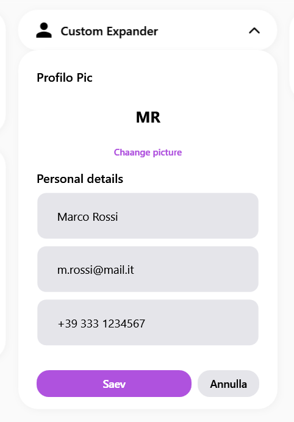
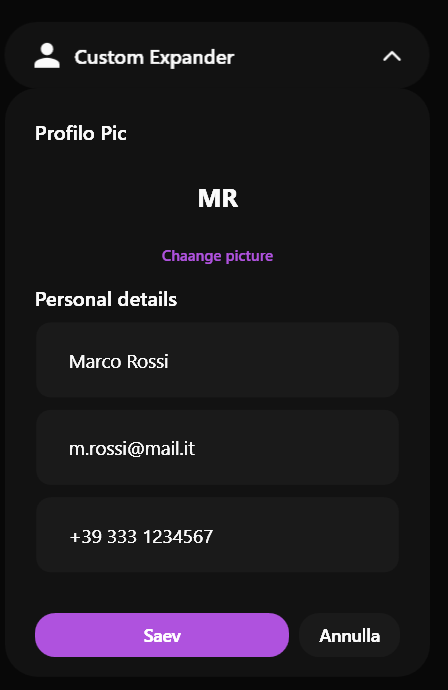

# SamsungExpander

### Screenshots
| Light | Dark |
|:---:|:---:|
|  |  |


Il `SamsungExpander` è un contenitore pieghevole che permette di nascondere dettagli secondari, rendendo l'interfaccia molto più pulita. 


> 📸 *Lo screenshot è in pausa caffè! Lo sviluppatore lo caricherà a breve.*

---

## 🇬🇧 English

The `SamsungExpander` is a collapsible container that hides secondary details, keeping the interface much cleaner. It animates both its dropdown content and its rotation chevron.

### Inheritance
Inherits directly from `System.Windows.Controls.Expander`. It natively supports `IsExpanded` and `Header` properties.

### Custom Properties

| Property | Type | Default Value | Description |
|-----------|------|-------------------|-------------|
| **IconContent** | `object` | `null` | Allows you to pass an icon (like a PackIcon) to display on the left side of the header. |

### Visual Behavior
- **Chevron Rotation**: The arrow on the right smoothly rotates 180 degrees when toggling the expanded state.
- **Content Reveal**: The internal content drops down gracefully instead of snapping instantly.
- **Hover**: Hovering the header highlights it with a rounded surface brush.

### How to Use
```xml
<sui:SamsungExpander Header="Advanced Options">
    <sui:SamsungExpander.IconContent>
        <TextBlock Text="⚙" FontSize="18"/>
    </sui:SamsungExpander.IconContent>
    
    <StackPanel Margin="16">
        <sui:SamsungCheckBox Content="Enable Logging" />
    </StackPanel>
</sui:SamsungExpander>
```

---

## 🇮🇹 Italiano

Il `SamsungExpander` è un contenitore pieghevole che permette di nascondere dettagli secondari, rendendo l'interfaccia molto più pulita. Presenta un'apertura fluida e una rotazione animata dell'icona direzionale.

### Ereditarietà
Eredita direttamente da `System.Windows.Controls.Expander`. Supporta nativamente la proprietà `IsExpanded` e `Header`.

### Proprietà Personalizzate

| Proprietà | Tipo | Valore di Default | Descrizione |
|-----------|------|-------------------|-------------|
| **IconContent** | `object` | `null` | Consente di inserire un'icona (es. un PackIcon o un TextBlock) da visualizzare alla sinistra dell'intestazione. |

### Comportamento Visivo
- **Rotazione Freccia (Chevron)**: La freccetta sulla destra ruota fluidamente di 180 gradi quando si apre o si chiude il pannello.
- **Rivelazione Contenuto**: Il contenuto interno scivola dolcemente verso il basso usando un'animazione (DoubleAnimation) invece di apparire di scatto.
- **Hover**: Passare il mouse sull'intestazione la illumina dolcemente, indicandone la cliccabilità.

### Come Usarlo
```xml
<sui:SamsungExpander Header="Opzioni Avanzate">
    <sui:SamsungExpander.IconContent>
        <TextBlock Text="⚙" FontSize="18"/>
    </sui:SamsungExpander.IconContent>
    
    <StackPanel Margin="16">
        <sui:SamsungCheckBox Content="Abilita Logging" />
    </StackPanel>
</sui:SamsungExpander>
```

