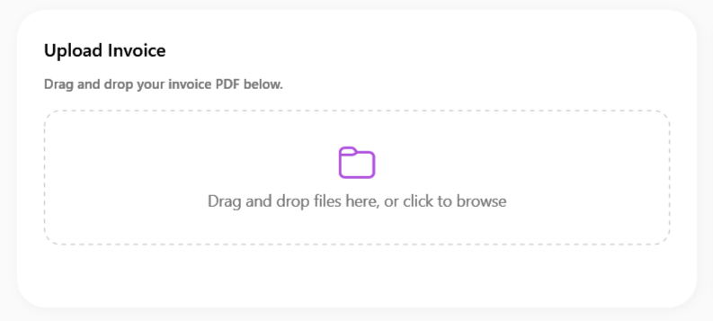
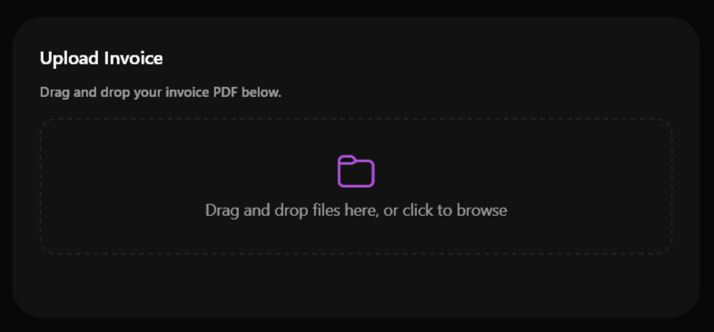

# SamsungFileDropZone

### Screenshots
| Light Mode | Dark Mode |
|:---:|:---:|
|  |  |


`SamsungFileDropZone` is a specialized control for handling drag-and-drop file operations with a modern, One UI-inspired aesthetic. It provides a distinct dashed border area that highlights when files are dragged over it, giving clear visual feedback to the user.

## Features

- **Visual Feedback**: Automatically highlights its background and border color when files are dragged over the control.
- **Customizable Text and Icon**: You can specify both the instruction text and the central icon (typically a fluent symbol like a cloud or folder).
- **FilesDropped Event**: Provides an easy-to-use event that triggers when files are successfully dropped into the area, returning an array of the file paths.
- **One UI Theming**: Automatically supports Dark and Light themes with dynamic brushes (`OneUiPrimaryBrush`, `OneUiControlBackgroundBrush`, etc.).

## Properties

| Property | Type | Default Value | Description |
|---|---|---|---|
| `Text` | `string` | `"Drag and drop files here"` | The main instruction text displayed in the center of the drop zone. |
| `Icon` | `string` | `"\uE8B7"` (Cloud) | The Segoe Fluent icon displayed above the text. |
| `CornerRadius` | `CornerRadius` | `16` | The corner radius of the dashed border and the highlight background. |
| `IsDragOver` | `bool` | `false` | (Read-only) Indicates whether the user is currently dragging files over the control. Modifies the visual state automatically. |

## Events

| Event | Delegate | Description |
|---|---|---|
| `FilesDropped` | `EventHandler<string[]>` | Fired when the user drops one or more files onto the control. Provides an array containing the absolute paths of the dropped files. |

## Example Usage

### XAML

```xml
<sui:SamsungFileDropZone x:Name="MyDropZone"
                         Text="Drag and drop your invoices here"
                         Icon="&#xE8B7;"
                         CornerRadius="12"
                         FilesDropped="MyDropZone_FilesDropped" />
```

### C# Code-Behind

```csharp
private void MyDropZone_FilesDropped(object sender, string[] files)
{
    if (files != null && files.Length > 0)
    {
        // Process the first file
        string firstFilePath = files[0];
        MessageBox.Show($"File dropped: {firstFilePath}");
        
        // Handle multiple files
        foreach (var file in files)
        {
            // Do something with each file
        }
    }
}
```

## Best Practices

- Use `SamsungFileDropZone` inside an Enterprise or Management application layout where bulk uploading of documents (invoices, photos, PDFs) is required.
- You can place a `SamsungContextMenu` inside the `SamsungFileDropZone` to offer alternative ways to upload files (e.g., "Click here to browse" or "Upload from folder").
- Pair this component with `SamsungToastService` to provide immediate feedback to the user upon a successful drop.


