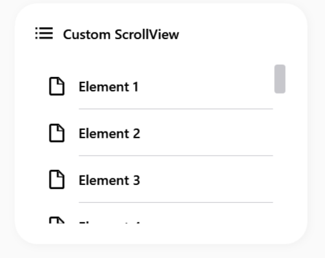

# SamsungListBox

Il `SamsungListBox` è un contenitore di liste fortemente arrotondato. Rimuove il classico bordo quadrato grigio di WPF in favore di un pannello morbido in cui ogni elemento selezionato adotta uno sfondo a pillola.


> 📸 *Lo screenshot è in pausa caffè! Lo sviluppatore lo caricherà a breve.*

---

## 🇬🇧 English

The `SamsungListBox` is a heavily rounded list container. It removes the classic gray square border of WPF in favor of a soft panel where every selected item adopts a pill-shaped background.

### Inheritance
- `SamsungListBox` inherits from `System.Windows.Controls.ListBox`.
- `SamsungListBoxItem` inherits from `System.Windows.Controls.ListBoxItem`.

### Custom Properties
There are no additional `DependencyProperty` configurations for this control.

### Visual Behavior
- **Container**: The list box itself has `CornerRadius="20"`, rendering it as a smooth, enclosed card.
- **List Items**: Hovering an item highlights it gently. Selecting an item highlights it with a solid primary color (with white text), and the highlight perfectly respects the internal rounding (pill shape).

### How to Use
```xml
<sui:SamsungListBox Height="150" Width="200">
    <sui:SamsungListBoxItem Content="Item 1" />
    <sui:SamsungListBoxItem Content="Item 2" />
    <sui:SamsungListBoxItem Content="Item 3" />
</sui:SamsungListBox>
```

---

## 🇮🇹 Italiano

Il `SamsungListBox` è un contenitore di liste fortemente arrotondato. Elimina il classico e rigido bordo quadrato grigio di WPF in favore di un pannello morbido e moderno. Ogni elemento al suo interno, quando selezionato, adotta uno sfondo a forma di pillola.

### Ereditarietà
- `SamsungListBox` eredita da `System.Windows.Controls.ListBox`.
- `SamsungListBoxItem` eredita da `System.Windows.Controls.ListBoxItem`.

### Proprietà Personalizzate
Questo componente non introduce nuove `DependencyProperty`. L'intera logica visiva è governata da XAML e Trigger.

### Comportamento Visivo
- **Contenitore (List Box)**: Ha un `CornerRadius="20"`, mostrandosi come una "card" protettiva.
- **Elementi della lista (Items)**: Passando il mouse sopra una voce, lo sfondo si illumina in grigio/superficie. Selezionando una voce, si accende col colore primario (e testo bianco), e la forma della selezione è a pillola (arrotondata), per non cozzare visivamente col tema One UI.

### Come Usarlo
```xml
<sui:SamsungListBox Height="150" Width="200">
    <sui:SamsungListBoxItem Content="Elemento 1" />
    <sui:SamsungListBoxItem Content="Elemento 2" />
    <sui:SamsungListBoxItem Content="Elemento 3" />
</sui:SamsungListBox>
```
