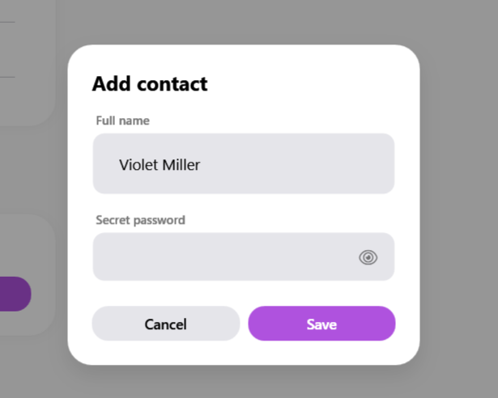
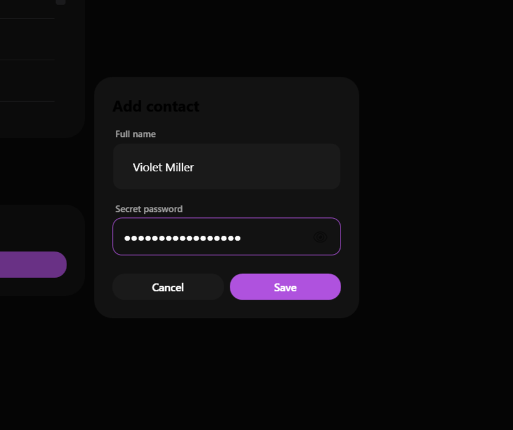

# SamsungModal

### Screenshots
| Light | Dark |
|:---:|:---:|
|  |  |


Il `SamsungModal` è un popup overlay a tutto schermo (Z-Index alto) che oscura il resto dell'applicazione e fa scivolare al centro una Card interattiva. Perfetto per le finestre di conferma, inserimento dati o avvisi critici.


> 📸 *Lo screenshot è in pausa caffè! Lo sviluppatore lo caricherà a breve.*

---

## 🇬🇧 English

The `SamsungModal` is a full-screen overlay popup that darkens the rest of the application and slides an interactive Card into the center. Perfect for confirmation dialogs, data entry, or critical alerts.

### Inheritance
Inherits from `System.Windows.Controls.ContentControl`. You place the exact content of the modal (e.g., text and buttons) inside it.

### Custom Properties

| Property | Type | Default Value | Description |
|-----------|------|-------------------|-------------|
| **IsOpen** | `bool` | `False` | Opens or closes the modal. You can bind this to your ViewModel. |
| **OverlayStyleKey** | `string` | `"SamsungModalOverlayStyle"` | Internal key for the dark semi-transparent background overlay. |

### Visual Behavior
- **Dark Overlay**: When `IsOpen=True`, a semi-transparent black background fades in, capturing all clicks and preventing interaction with the page behind it.
- **Card Slide**: The actual content (wrapped in a `SamsungCard`) slides down into view and scales up slightly (`ScaleTransform`), mimicking native Android/Samsung dialog behaviors.

### How to Use
Typically, you place the `SamsungModal` at the very end of your root `Grid` so it renders on top of everything else.

```xml
<Grid>
    <!-- Your main app content -->
    
    <!-- The Modal -->
    <sui:SamsungModal IsOpen="{Binding IsMyModalOpen}">
        <StackPanel Margin="24">
            <TextBlock Text="Are you sure?" FontSize="20" FontWeight="Bold"/>
            <!-- Action buttons -->
        </StackPanel>
    </sui:SamsungModal>
</Grid>
```

---

## 🇮🇹 Italiano

Il `SamsungModal` è un popup overlay a schermo intero che oscura il resto dell'applicazione e fa scivolare dolcemente al centro un riquadro interattivo. È essenziale per finestre di conferma, form di inserimento dati e avvisi critici senza dover aprire nuove finestre di sistema.

### Ereditarietà
Eredita da `System.Windows.Controls.ContentControl`. Al suo interno posizionerai fisicamente il contenuto del messaggio (es. testo e bottoni).

### Proprietà Personalizzate

| Proprietà | Tipo | Valore di Default | Descrizione |
|-----------|------|-------------------|-------------|
| **IsOpen** | `bool` | `False` | Apre o chiude il modale. È bindabile a una variabile del tuo ViewModel. |
| **OverlayStyleKey** | `string` | `"SamsungModalOverlayStyle"` | Chiave interna per lo stile dello sfondo scuro semi-trasparente. |

### Comportamento Visivo
- **Sfondo Scuro (Overlay)**: Quando `IsOpen=True`, appare in dissolvenza uno sfondo nero semi-trasparente che "blocca" i click sull'interfaccia retrostante (comportamento modale).
- **Animazione Card**: Il contenuto vero e proprio (che viene incapsulato automaticamente in una `SamsungCard`) scivola giù dal centro e si ingrandisce leggermente, replicando il tipico comportamento delle finestre di dialogo Android/Samsung.

### Come Usarlo
Il segreto è inserire il `SamsungModal` come **ultimo elemento** all'interno del `Grid` principale (root) della tua finestra/pagina, in modo che sia sempre disegnato in cima a tutto (Z-Index maggiore).

```xml
<Grid>
    <!-- Contenuto principale dell'app -->
    
    <!-- Il Modale -->
    <sui:SamsungModal IsOpen="{Binding IsMyModalOpen}">
        <StackPanel Margin="24">
            <TextBlock Text="Sei sicuro di voler eliminare?" FontSize="20" FontWeight="Bold"/>
            <!-- Bottoni di azione -->
        </StackPanel>
    </sui:SamsungModal>
</Grid>
```

