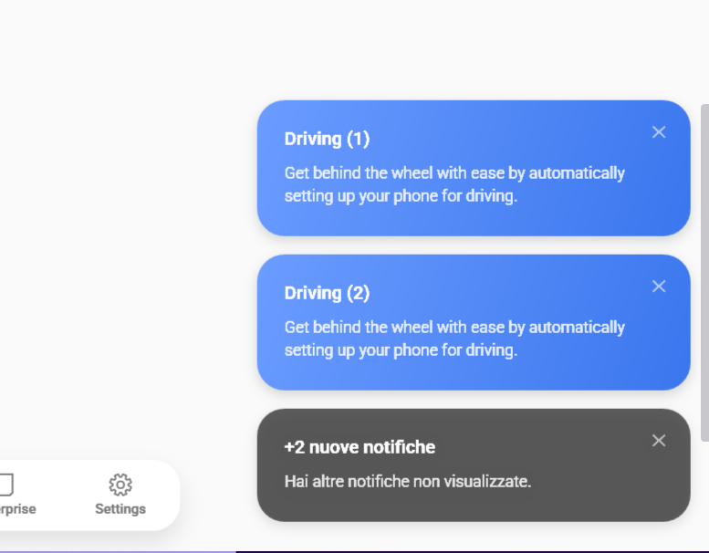

# SamsungNotification & SamsungNotificationService

### Screenshots
| Light Mode | Dark Mode |
|:---:|:---:|
|  |  |


`SamsungNotification` e `SamsungNotificationService` forniscono un sistema avanzato di notifiche fluttuanti (in stile "Toast") che si impilano elegantemente sullo schermo. Supportano posizionamenti multipli, icone personalizzate, azioni al clic, feedback sonoro e rimozione automatica con animazioni fluide.

---

## 🇬🇧 English

### Overview
You can show notifications in two ways:
1. **Programmatically** using C# with `SamsungNotificationService.Show()`.
2. **Declaratively** in XAML using `<sui:SamsungNotification>` which supports data binding.

### Properties / Parameters

| Property / Parameter | Type | Default Value | Description |
|----------------------|------|---------------|-------------|
| **Title** | `string` | `""` | The bold header text of the notification. |
| **Description** | `string` | `""` | The secondary detail description text. |
| **CardBackground** / **background** | `Brush` | `null` | The background color of the notification card (e.g., green for success, red for error). |
| **Icon** / **icon** | `ImageSource` | `null` | Optional icon image to display on the left. |
| **NotificationPosition** / **position** | `NotificationPosition` | `TopRight` | Corner/edge to display the stack (`TopLeft`, `TopCenter`, `TopRight`, `BottomLeft`, `BottomCenter`, `BottomRight`). |
| **DurationMs** / **durationMs** | `int` | `4000` | Duration (in milliseconds) before the notification auto-dismisses. |
| **IsSoundOn** / **isSoundOn** | `bool` | `false` | Plays a modern One UI bubble notification sound (`buble_noty.mp3`) when appearing. |
| **IsOpen** | `bool` | `false` | (XAML only) Binding-friendly property that triggers the notification when set to `true`. |

### Page-Based / Frame Navigation Note
> [!IMPORTANT]
> When using WPF `Frame` navigation (like pages hosted inside a main window frame), using static code `SamsungNotificationService.Show()` might not resolve the correct `AdornerLayer` or window bounds.
> The recommended pattern is **declarative XAML**: declare the `<sui:SamsungNotification>` components inside the root `Grid` of your `Page` and invoke them via binding to `IsOpen` or calling `.Show()` on the named element in the code-behind.

### XAML Example
```xml
<Grid>
    <!-- Main page contents -->

    <!-- Success Notification -->
    <sui:SamsungNotification x:Name="SuccessNotification"
                              Title="Action Completed"
                              Description="The item was updated successfully."
                              CardBackground="{DynamicResource OneUiPrimaryBrush}"
                              NotificationPosition="BottomRight"
                              IsSoundOn="True" />
</Grid>
```

In Code-Behind:
```csharp
SuccessNotification.Show();
```

### C# Service Example
```csharp
SamsungNotificationService.Show(
    title: "Success",
    description: "Item saved successfully",
    background: Brushes.Green,
    position: NotificationPosition.BottomRight,
    isSoundOn: true
);
```

---

## 🇮🇹 Italiano

### Panoramica
Puoi mostrare notifiche in due modi:
1. **Via codice** in C# con `SamsungNotificationService.Show()`.
2. **Dichiarativamente** in XAML usando `<sui:SamsungNotification>`, che supporta il data binding.

### Proprietà / Parametri

| Proprietà / Parametro | Tipo | Valore Default | Descrizione |
|-----------------------|------|----------------|-------------|
| **Title** | `string` | `""` | Il titolo principale in grassetto della notifica. |
| **Description** | `string` | `""` | Il testo di dettaglio secondario. |
| **CardBackground** / **background** | `Brush` | `null` | Il colore di sfondo del fumetto (es. verde per successo, rosso per errore). |
| **Icon** / **icon** | `ImageSource` | `null` | Icona opzionale da mostrare sulla sinistra. |
| **NotificationPosition** / **position** | `NotificationPosition` | `TopRight` | Angolo in cui impilare le notifiche (`TopLeft`, `TopCenter`, `TopRight`, `BottomLeft`, `BottomCenter`, `BottomRight`). |
| **DurationMs** / **durationMs** | `int` | `4000` | Durata (in millisecondi) prima dell'auto-chiusura. |
| **IsSoundOn** / **isSoundOn** | `bool` | `false` | Se abilitato, riproduce il suono di notifica One UI (`buble_noty.mp3`) all'apparizione. |
| **IsOpen** | `bool` | `false` | (Solo XAML) Proprietà per i binding: mostra la notifica non appena viene impostata a `true` (e si resetta automaticamente). |

### Nota per Navigazione con Frame / Page
> [!IMPORTANT]
> Quando si utilizzano le `Page` WPF all'interno di un `Frame`, l'uso statico di `SamsungNotificationService.Show()` potrebbe fallire nel trovare il corretto `AdornerLayer` della pagina corrente.
> Il pattern raccomandato per le pagine è **dichiarativo**: inserisci l'elemento `<sui:SamsungNotification>` all'interno del `Grid` principale della tua `Page` e mostralo impostando `IsOpen="True"` o chiamando il metodo `.Show()` sull'elemento denominato dal code-behind.

### Esempio XAML
```xml
<Grid>
    <!-- Contenuto principale della pagina -->

    <!-- Notifica di successo in basso a destra -->
    <sui:SamsungNotification x:Name="SuccessNotification"
                              Title="Operazione Completata"
                              Description="La riga è stata modificata con successo."
                              CardBackground="{DynamicResource OneUiPrimaryBrush}"
                              NotificationPosition="BottomRight"
                              IsSoundOn="True" />
</Grid>
```

Nel Code-Behind:
```csharp
SuccessNotification.Show();
```

### Esempio Servizio C#
```csharp
SamsungNotificationService.Show(
    title: "Salvataggio",
    description: "Modifiche salvate con successo.",
    background: Brushes.Green,
    position: NotificationPosition.BottomRight,
    isSoundOn: true
);
```


