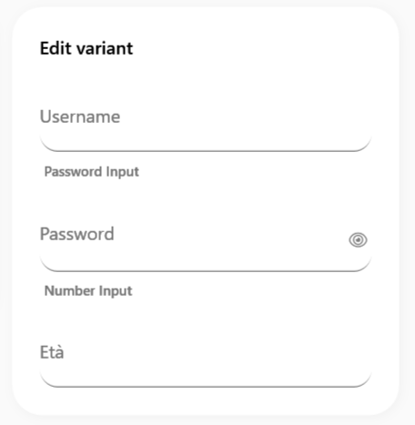
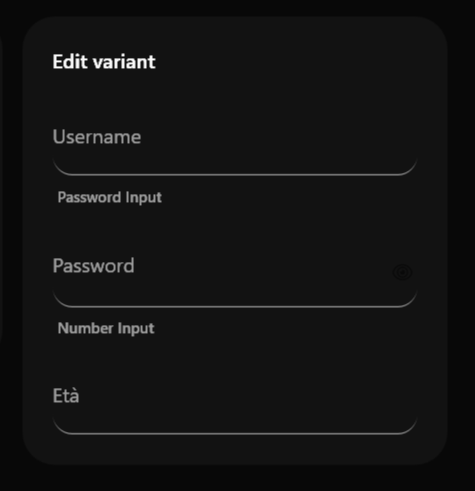

# SamsungPasswordBox

### Screenshots
| Light Mode | Dark Mode |
|:---:|:---:|
|  |  |


Il `SamsungPasswordBox` è il campo specifico per l'inserimento di dati sensibili (come password o PIN), progettato esteticamente come un `SamsungTextBox` ma con funzionalità di mascheramento dei caratteri e un pulsante integrato per rivelare temporaneamente la password.


> 📸 *Lo screenshot è in pausa caffè! Lo sviluppatore lo caricherà a breve.*

---

## 🇬🇧 English

The `SamsungPasswordBox` is the specific field for entering sensitive data (like passwords or PINs). It is aesthetically designed like a `SamsungTextBox` but includes character masking features and an integrated toggle button to reveal the password.

### Inheritance
This control inherits from `System.Windows.Controls.Control`. Internally, it manages a native `PasswordBox` and a `TextBox` to safely swap between masked and unmasked text.

### Custom Properties

| Property | Type | Default Value | Description |
|-----------|------|-------------------|-------------|
| **Password** | `string` | `""` | The password content. Supports two-way binding. |
| **IsPasswordRevealed** | `bool` | `False` | Gets or sets whether the password is currently shown as clear text. |
| **Placeholder** | `string` | `""` | The placeholder text to display when empty. |
| **CornerRadius** | `CornerRadius` | `12` | Corner smoothing. |

### Visual Behavior
- **Reveal Button**: An eye icon is displayed on the right edge of the text field. Clicking it toggles `IsPasswordRevealed`, swapping the masked view with the clear text view.
- **Design**: Shares the exact same rounded corners, surface background, and focus highlight border as the standard `SamsungTextBox`.

### How to Use
```xml
<sui:SamsungPasswordBox Password="{Binding UserPassword, Mode=TwoWay}" Width="250" />
```

---

## 🇮🇹 Italiano

Il `SamsungPasswordBox` è il campo specifico per l'inserimento di dati sensibili (come password o PIN), progettato esteticamente come un `SamsungTextBox` ma con funzionalità di mascheramento dei caratteri e un pulsante integrato per rivelare temporaneamente la password.

### Ereditarietà
Questo controllo eredita da `System.Windows.Controls.Control`. Internamente, gestisce un `PasswordBox` nativo e un `TextBox` base, permettendo lo scambio sicuro tra il testo mascherato e quello in chiaro.

### Proprietà Personalizzate

| Proprietà | Tipo | Valore di Default | Descrizione |
|-----------|------|-------------------|-------------|
| **Password** | `string` | `""` | Il contenuto della password. Supporta il data-binding bidirezionale. |
| **IsPasswordRevealed** | `bool` | `False` | Ottiene o imposta se la password è attualmente visibile in chiaro. |
| **Placeholder** | `string` | `""` | Il testo di suggerimento mostrato quando vuoto. |
| **CornerRadius** | `CornerRadius` | `12` | Smussatura degli angoli. |

### Comportamento Visivo
- **Pulsante Rivela**: Sul margine destro compare l'icona di un occhio. Cliccandola si inverte il valore di `IsPasswordRevealed`, scambiando la vista mascherata (con i puntini neri) con quella in chiaro.
- **Design Base**: Condivide gli stessi bordi smussati, lo sfondo neutro di superficie e l'evidenziazione del bordo al focus del `SamsungTextBox` standard.

### Come Usarlo
```xml
<sui:SamsungPasswordBox Password="{Binding UserPassword, Mode=TwoWay}" Width="250" />
```

