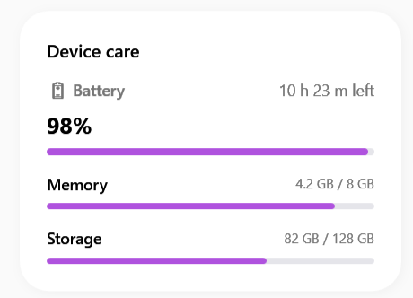
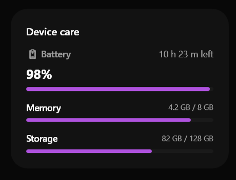

# SamsungProgressBar

### Screenshots
| Light Mode | Dark Mode |
|:---:|:---:|
|  |  |


Il `SamsungProgressBar` è una barra di avanzamento moderna che utilizza angoli completamente arrotondati (a pillola) e un'animazione fluida per mostrare il caricamento o lo stato di un'operazione.


> 📸 *Lo screenshot è in pausa caffè! Lo sviluppatore lo caricherà a breve.*

---

## 🇬🇧 English

The `SamsungProgressBar` is a modern progress bar that utilizes fully rounded corners (pill shape) and fluid animation to display loading states or operation progress.

### Inheritance
Inherits natively from `System.Windows.Controls.ProgressBar`. It fully supports `Value`, `Minimum`, `Maximum`, and `IsIndeterminate`.

### Custom Properties
There are no additional `DependencyProperty` configurations for this control. The continuous animation for the indeterminate state and the rounded track are fully defined via XAML styles.

### Visual Behavior
- **Determinate (`Value="50"`)**: The colored track smoothly fills the background track with a pill-shaped ending.
- **Indeterminate (`IsIndeterminate="True"`)**: A smaller segment of the primary color endlessly loops back and forth across the track using a custom `Storyboard`, mimicking the One UI loading behavior perfectly.

### How to Use
```xml
<!-- Determinate Progress -->
<sui:SamsungProgressBar Minimum="0" Maximum="100" Value="75" />

<!-- Indeterminate Loading -->
<sui:SamsungProgressBar IsIndeterminate="True" />
```

---

## 🇮🇹 Italiano

Il `SamsungProgressBar` è una barra di avanzamento moderna che utilizza angoli completamente arrotondati (a pillola) e un'animazione fluida per mostrare il caricamento o lo stato di un'operazione.

### Ereditarietà
Eredita in modo nativo da `System.Windows.Controls.ProgressBar`. Supporta in modo completo `Value`, `Minimum`, `Maximum`, e `IsIndeterminate`.

### Proprietà Personalizzate
Non ci sono `DependencyProperty` aggiuntive. L'animazione per lo stato indeterminato e il binario arrotondato sono completamente definiti all'interno degli stili XAML.

### Comportamento Visivo
- **Determinato (`Value="50"`)**: La barra colorata riempie fluidamente il binario di sfondo, terminando sempre con una forma smussata.
- **Indeterminato (`IsIndeterminate="True"`)**: Un segmento del colore primario scorre avanti e indietro all'infinito grazie a una `Storyboard` personalizzata, emulando alla perfezione il caricamento di sistema della One UI.

### Come Usarlo
```xml
<!-- Progressione con valore esatto -->
<sui:SamsungProgressBar Minimum="0" Maximum="100" Value="75" />

<!-- Caricamento indeterminato -->
<sui:SamsungProgressBar IsIndeterminate="True" />
```


