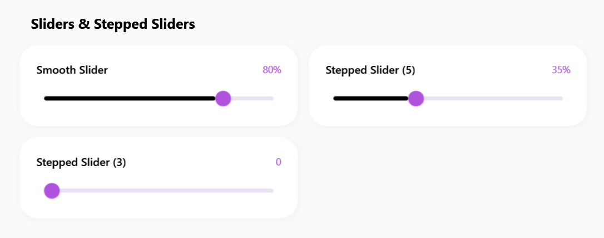
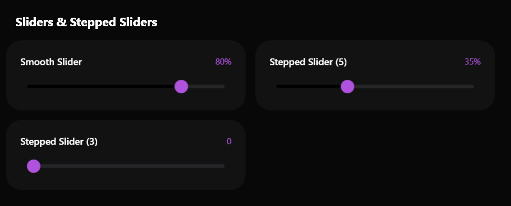

# SamsungSlider

### Screenshots
| Light | Dark |
|:---:|:---:|
|  |  |


Il `SamsungSlider` è un componente per la selezione continua o a step di valori numerici. Presenta il distintivo binario arrotondato (Track) e un pomello (Thumb) ampio, per facilitare l'uso su schermi touch o con il mouse in modo confortevole.


> 📸 *Lo screenshot è in pausa caffè! Lo sviluppatore lo caricherà a breve.*

---

## 🇬🇧 English

The `SamsungSlider` is a component for continuous or stepped selection of numeric values. It features the distinctive rounded track and a generously sized thumb, making it easy and comfortable to use on both touch screens and with a mouse.

### Inheritance
This control inherits from the native WPF `System.Windows.Controls.Slider`.
It seamlessly integrates with standard properties such as `Minimum`, `Maximum`, `Value`, `TickPlacement`, and `IsSnapToTickEnabled`.

### Custom Properties
The slider does not introduce new `DependencyProperty`. The rounded track, the colored progression fill, and the thumb scaling animations are entirely handled by the XAML template.

### Visual Behavior
- **Track**: The background track uses a subtle surface color, while the active portion (from Minimum to Value) is filled with the primary accent color.
- **Thumb**: A stark white or dark circle (based on theme) with a soft shadow.
- **Hover/Drag (`IsMouseOver` / `IsDragging`)**: The thumb smoothly increases in size when hovered or dragged, offering excellent tactile-like visual feedback.

### How to Use

**1. Continuous Slider**
```xml
<sui:SamsungSlider Minimum="0" Maximum="100" Value="50" />
```

**2. Stepped Slider (with Snapping)**
```xml
<sui:SamsungSlider Minimum="0" Maximum="10" Value="5" 
                   TickFrequency="1" IsSnapToTickEnabled="True" />
```

---

## 🇮🇹 Italiano

Il `SamsungSlider` è un componente per la selezione continua o a step di valori numerici. Presenta il distintivo binario arrotondato (Track) e un pomello (Thumb) ampio, per facilitare l'uso su schermi touch o con il mouse in modo confortevole.

### Ereditarietà
Questo controllo eredita nativamente da `System.Windows.Controls.Slider`.
Si integra perfettamente con le proprietà standard come `Minimum`, `Maximum`, `Value`, `TickPlacement`, e `IsSnapToTickEnabled`.

### Proprietà Personalizzate
Lo slider non introduce nuove `DependencyProperty`. Il binario arrotondato, il riempimento colorato della progressione e le animazioni di ridimensionamento del pomello sono gestiti interamente nel template XAML.

### Comportamento Visivo
- **Binario (Track)**: Il binario di sfondo ha un colore neutro, mentre la porzione attiva (dal minimo fino al valore attuale) è riempita col colore di accento primario.
- **Pomello (Thumb)**: Un cerchio bianco o scuro (in base al tema) con una delicata ombra per staccarlo dallo sfondo.
- **Hover/Drag (`IsMouseOver` / `IsDragging`)**: Quando il mouse passa sopra o si inizia il trascinamento, il pomello si ingrandisce fluidamente, offrendo un eccellente feedback visivo simil-tattile.

### Come Usarlo

**1. Slider Continuo**
```xml
<sui:SamsungSlider Minimum="0" Maximum="100" Value="50" />
```

**2. Slider a Scatti (Stepped)**
```xml
<sui:SamsungSlider Minimum="0" Maximum="10" Value="5" 
                   TickFrequency="1" IsSnapToTickEnabled="True" />
```

