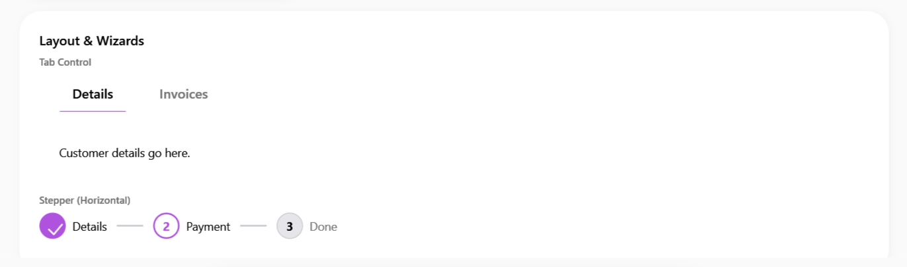
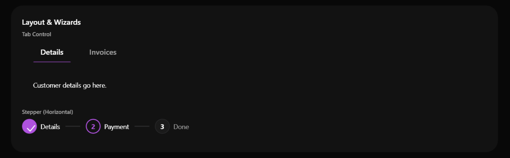

# SamsungTabControl

### Screenshots
| Light Mode | Dark Mode |
|:---:|:---:|
|  |  |


Il `SamsungTabControl` offre una navigazione orizzontale a schede con un'estetica tipica delle app mobile moderne, utilizzando linee di selezione animate ed effetti hover a "pillola".


> 📸 *Lo screenshot è in pausa caffè! Lo sviluppatore lo caricherà a breve.*

---

## 🇬🇧 English

The `SamsungTabControl` provides horizontal tabbed navigation with a modern mobile-app aesthetic, utilizing animated selection indicator lines and "pill-shaped" hover effects.

### Inheritance
Inherits directly from `System.Windows.Controls.TabControl`, while its items (`sui:SamsungTabItem`) inherit from `TabItem`.

### Custom Properties
There are no additional `DependencyProperty` configurations for this control. The custom appearance is defined purely via XAML styles.

### Visual Behavior
- **Headers**: Styled as centered text blocks with ample spacing. Unselected tabs are slightly dimmed.
- **Hover**: Hovering over a tab item displays a soft pill-shaped background behind the text.
- **Selection**: The active tab is indicated by a primary-colored underline that seamlessly animates (or appears) under the selected item.

### How to Use
```xml
<sui:SamsungTabControl>
    <sui:SamsungTabItem Header="Details">
        <TextBlock Text="First Page Content" />
    </sui:SamsungTabItem>
    <sui:SamsungTabItem Header="Settings">
        <TextBlock Text="Second Page Content" />
    </sui:SamsungTabItem>
</sui:SamsungTabControl>
```

---

## 🇮🇹 Italiano

Il `SamsungTabControl` offre una navigazione orizzontale a schede con un'estetica tipica delle app mobile moderne, utilizzando linee di selezione animate ed effetti hover a "pillola".

### Ereditarietà
Eredita direttamente da `System.Windows.Controls.TabControl`, mentre i suoi elementi figli (`sui:SamsungTabItem`) ereditano nativamente da `TabItem`.

### Proprietà Personalizzate
Non ci sono nuove `DependencyProperty` in C#. Tutto il design personalizzato e le animazioni risiedono nei template XAML.

### Comportamento Visivo
- **Intestazioni (Headers)**: Formattate come testo centrato con ampio respiro. Le tab non selezionate appaiono leggermente sbiadite (grigie).
- **Hover**: Passando il mouse sopra una tab, appare uno sfondo morbido a forma di pillola dietro il testo.
- **Selezione**: La tab attiva è indicata dal testo in risalto (Primary Color o Nero intenso) e da una linea colorata alla base dell'intestazione.

### Come Usarlo
```xml
<sui:SamsungTabControl>
    <sui:SamsungTabItem Header="Dettagli">
        <TextBlock Text="Contenuto prima pagina" />
    </sui:SamsungTabItem>
    <sui:SamsungTabItem Header="Impostazioni">
        <TextBlock Text="Contenuto seconda pagina" />
    </sui:SamsungTabItem>
</sui:SamsungTabControl>
```

