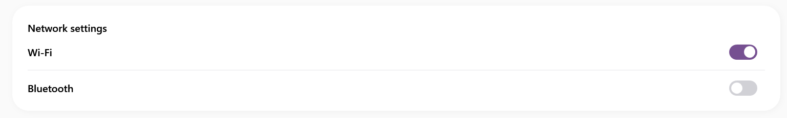

# SamsungToggleSwitch

> *Screenshot is on a coffee break! The developer will upload it shortly.*
> *Lo screenshot e' in pausa caffe'! Lo sviluppatore lo carichera' a breve.*

---

## English

The $c is a core element of the **SamsungUi** library, designed to bring the fluid and rounded aesthetics of One UI to your WPF applications.

### Inheritance
This control inherits from the standard WPF equivalent (or Control), fully supporting native properties, bindings, and events.

### How to Use

`xml
<sui:SamsungToggleSwitch />
``n
---

## Italiano

Il $c e' un elemento essenziale della libreria **SamsungUi**, progettato per portare l'estetica fluida e tondeggiante della One UI nelle tue applicazioni WPF.

### Ereditarieta'
Questo controllo eredita dall'equivalente standard WPF (o da Control), supportando nativamente tutte le proprieta', i binding e gli eventi classici.

### Come Usarlo

`xml
<sui:SamsungToggleSwitch />
``n
