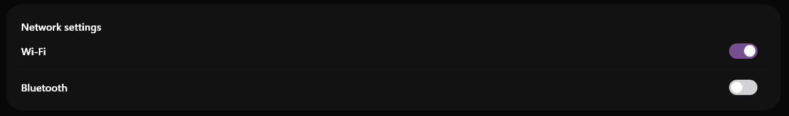

# SamsungToggleSwitch

### Screenshots
| Light Mode | Dark Mode |
|:---:|:---:|
|  |  |


Il `SamsungToggleSwitch` sostituisce l'utilizzo della CheckBox per le impostazioni globali o le funzionalità che necessitano di un'attivazione stile "Acceso/Spento". Presenta la classica animazione fluida in cui un "pomello" scivola orizzontalmente.


> 📸 *Lo screenshot è in pausa caffè! Lo sviluppatore lo caricherà a breve.*

---

## 🇬🇧 English

The `SamsungToggleSwitch` replaces the typical CheckBox for global settings or toggle features (On/Off). It features the classic fluid animation where the "thumb" knob slides horizontally along a colored track.

### Inheritance
Despite its completely different appearance, this control safely inherits from `System.Windows.Controls.CheckBox`. 
This is a conscious design choice: it allows developers to keep using `IsChecked`, `Checked`, and `Unchecked` without having to learn a new API.

### Custom Properties
There are no additional `DependencyProperty` configurations for this control. The sliding thumb and track transitions are managed through a custom ControlTemplate and Storyboards in XAML.

### Visual Behavior
- **Off (`IsChecked=False`)**: The track is gray/surface-colored, and the thumb rests on the left.
- **On (`IsChecked=True`)**: The track smoothly transitions to the Primary Accent Color, and the thumb slides to the right via a fluid `ThicknessAnimation`.
- **Hover (`IsMouseOver`)**: The thumb subtly darkens or lightens (based on theme) indicating interactivity.

### How to Use
```xml
<sui:SamsungToggleSwitch Content="Enable Wi-Fi" IsChecked="True" />
```

---

## 🇮🇹 Italiano

Il `SamsungToggleSwitch` sostituisce l'utilizzo della CheckBox per le impostazioni globali o le funzionalità che necessitano di un'attivazione stile "Acceso/Spento". Presenta la classica animazione fluida in cui un "pomello" scivola orizzontalmente.

### Ereditarietà
Nonostante l'aspetto radicalmente diverso, questo controllo eredita in modo intelligente da `System.Windows.Controls.CheckBox`.
Questa scelta progettuale permette agli sviluppatori di continuare ad usare le ben note proprietà `IsChecked`, `Checked` e `Unchecked` senza dover imparare una nuova API.

### Proprietà Personalizzate
Non ci sono nuove `DependencyProperty`. L'animazione di scivolamento e il cambio cromatico del binario sono gestiti unicamente tramite ControlTemplate e Storyboard XAML.

### Comportamento Visivo
- **Off (`IsChecked=False`)**: Il binario ha un colore neutro di superficie e il pomello è parcheggiato a sinistra.
- **On (`IsChecked=True`)**: Il binario si accende sfumando verso il colore principale (Primary Accent), e il pomello scivola fluidamente a destra grazie a una `ThicknessAnimation`.
- **Hover (`IsMouseOver`)**: Il pomello cambia leggermente tonalità per suggerire l'interazione al passaggio del mouse.

### Come Usarlo
```xml
<sui:SamsungToggleSwitch Content="Attiva Wi-Fi" IsChecked="True" />
```


